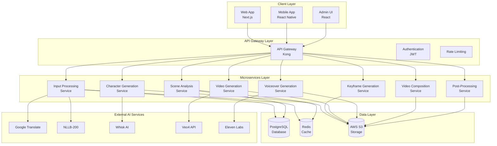
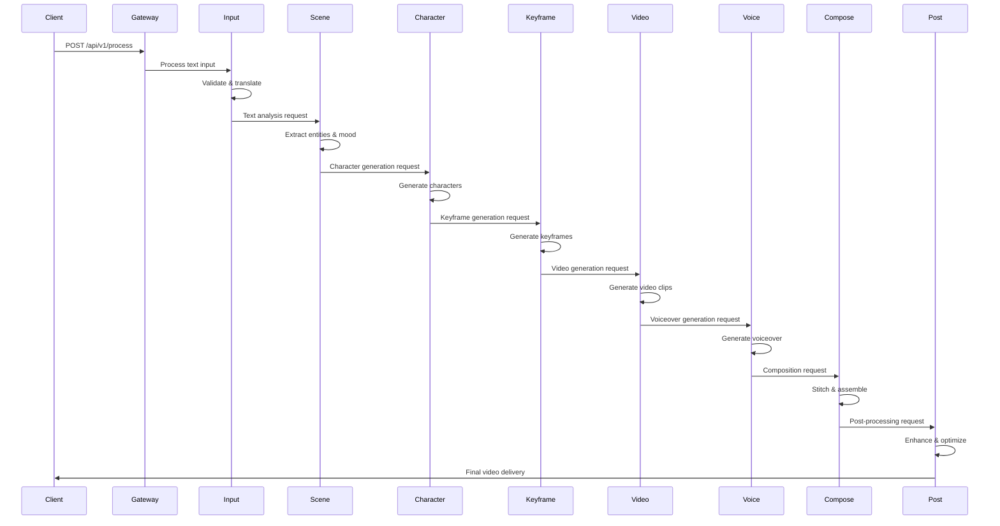

# System Architecture

## 🏗️ High-Level Architecture Overview

CinBoard AI is built on a modern microservices architecture designed for scalability, reliability, and performance. The system implements Single Responsibility Principle (SRP) compliance across all services, ensuring maintainability and extensibility.



## 🔧 Microservices Architecture

### 1. Input Processing Service ✅ **IMPLEMENTED**

**Port**: 8002  
**Status**: Fully operational with SRP-compliant architecture  
**Responsibilities**: Text validation, language detection, translation, preprocessing

#### Architecture Components
```
input-processing-service/
├── workflows/
│   └── pipeline.py - Single responsibility: workflow orchestration
├── endpoints/
│   ├── validation.py - Single responsibility: HTTP validation requests
│   ├── processing.py - Single responsibility: HTTP processing requests
│   └── status.py - Single responsibility: HTTP status requests
├── services/
│   ├── translation/
│   │   ├── providers/
│   │   │   ├── google_translator.py - Google Translate API
│   │   │   ├── nllb_translator.py - NLLB translation
│   │   │   └── strategy.py - Fallback chain management
│   │   └── translation_facade.py - API compatibility
│   ├── input_validation.py - Content policy validation
│   ├── language_detection.py - Language identification
│   └── text_preprocessing.py - Text normalization
├── repositories/
│   ├── input_repository.py - InputRecord CRUD operations
│   └── status_repository.py - ProcessingStatus CRUD operations
└── cache/
    └── cache_manager.py - Centralized cache operations
```

#### Key Features
- **Multilingual Support**: Telugu, Hindi, English with Unicode handling
- **Translation Pipeline**: Google Translate → NLLB-200 fallback
- **Input Validation**: Content policy, length, format validation
- **Status Tracking**: Comprehensive processing phase tracking

### 2. Scene Analysis Service 🔄 **PLANNED**

**Port**: 8020  
**Status**: Planned but not implemented  
**Responsibilities**: Entity extraction, mood analysis, camera cues, temporal analysis

#### Planned Components
```
scene-analysis-service/
├── services/
│   ├── entity_extraction.py - Character, object, location extraction
│   ├── mood_analysis.py - Emotional tone analysis
│   ├── camera_analysis.py - Camera movement detection
│   └── temporal_analysis.py - Sequence analysis
├── orchestrator/
│   └── scene_orchestrator.py - Workflow coordination
└── models/
    ├── entities.py - Entity data models
    └── analysis_results.py - Analysis result models
```

#### Key Features
- **Entity Extraction**: Characters, objects, locations, actions
- **Mood Analysis**: Emotional tone and atmosphere detection
- **Camera Cues**: Shot types, movements, transitions
- **Temporal Analysis**: Scene sequencing and timing

### 3. Character Generation Service ⚠️ **NEW REQUIREMENT**

**Port**: 8030  
**Status**: New requirement from GenAI workflow  
**Responsibilities**: Consistent character creation using Whisk AI

#### Planned Components
```
character-generation-service/
├── services/
│   ├── character_analysis.py - Character description analysis
│   ├── whisk_integration.py - Whisk AI API integration
│   └── character_consistency.py - Character consistency management
├── models/
│   ├── character.py - Character data models
│   └── character_image.py - Character image models
└── cache/
    └── character_cache.py - Character image caching
```

#### Key Features
- **Character Analysis**: Extract character descriptions from text
- **Whisk Integration**: Generate consistent character images
- **Character Consistency**: Maintain appearance across scenes
- **Character Caching**: Cache character images for reuse

### 4. Keyframe Generation Service ⚠️ **NEW REQUIREMENT**

**Port**: 8040  
**Status**: New requirement from GenAI workflow  
**Responsibilities**: Generate 1-3 keyframes per 8-second video clip

#### Planned Components
```
keyframe-generation-service/
├── services/
│   ├── keyframe_analysis.py - Keyframe timing analysis
│   ├── image_generation.py - Keyframe image generation
│   └── keyframe_optimization.py - Keyframe quality optimization
├── models/
│   ├── keyframe.py - Keyframe data models
│   └── scene_breakdown.py - Scene breakdown models
└── cache/
    └── keyframe_cache.py - Keyframe image caching
```

#### Key Features
- **Keyframe Analysis**: Determine optimal keyframe timing
- **Image Generation**: Generate high-quality keyframe images
- **Scene Breakdown**: Parse scenes into keyframe sequences
- **Quality Optimization**: Ensure keyframe quality and consistency

### 5. Video Generation Service 🔄 **PLANNED**

**Port**: 8050  
**Status**: Planned but not implemented  
**Responsibilities**: Veo4 integration for video creation from keyframes

#### Planned Components
```
video-generation-service/
├── services/
│   ├── veo4_integration.py - Veo4 API integration
│   ├── video_processing.py - Video processing and enhancement
│   └── quality_assurance.py - Video quality validation
├── models/
│   ├── video_clip.py - Video clip data models
│   └── generation_params.py - Generation parameters
└── cache/
    └── video_cache.py - Video clip caching
```

#### Key Features
- **Veo4 Integration**: Generate videos from keyframes and characters
- **Video Processing**: Enhance and optimize generated videos
- **Quality Assurance**: Automated quality validation
- **Video Caching**: Cache generated video clips

### 6. Voiceover Generation Service ⚠️ **NEW REQUIREMENT**

**Port**: 8060  
**Status**: New requirement from GenAI workflow  
**Responsibilities**: Eleven Labs integration for multilingual voiceover

#### Planned Components
```
voiceover-generation-service/
├── services/
│   ├── eleven_labs_integration.py - Eleven Labs API integration
│   ├── voice_analysis.py - Voice and tone analysis
│   └── multilingual_voice.py - Multilingual voice synthesis
├── models/
│   ├── voiceover.py - Voiceover data models
│   └── voice_settings.py - Voice configuration models
└── cache/
    └── voice_cache.py - Voiceover audio caching
```

#### Key Features
- **Eleven Labs Integration**: High-quality voice synthesis
- **Multilingual Support**: Voice generation in multiple languages
- **Voice Analysis**: Analyze text for appropriate voice selection
- **Voice Consistency**: Maintain consistent voice across scenes

### 7. Video Composition Service ⚠️ **NEW REQUIREMENT**

**Port**: 8070  
**Status**: New requirement from GenAI workflow  
**Responsibilities**: Automated video stitching and final assembly

#### Planned Components
```
video-composition-service/
├── services/
│   ├── video_stitching.py - Video clip stitching
│   ├── audio_sync.py - Audio synchronization
│   └── final_assembly.py - Final video assembly
├── models/
│   ├── composition.py - Composition data models
│   └── final_video.py - Final video models
└── processors/
    ├── ffmpeg_processor.py - FFmpeg integration
    └── audio_processor.py - Audio processing
```

#### Key Features
- **Video Stitching**: Seamlessly combine video clips
- **Audio Synchronization**: Sync voiceover with video
- **Final Assembly**: Create complete storytelling video
- **Quality Enhancement**: Final quality optimization

### 8. Post-Processing Service 🔄 **PLANNED**

**Port**: 8080  
**Status**: Planned but not implemented  
**Responsibilities**: Quality enhancement, optimization, and delivery

#### Planned Components
```
post-processing-service/
├── services/
│   ├── quality_enhancement.py - Video quality enhancement
│   ├── optimization.py - Video optimization
│   └── delivery.py - Video delivery and CDN
├── models/
│   ├── enhancement.py - Enhancement data models
│   └── delivery.py - Delivery data models
└── processors/
    ├── video_enhancer.py - Video enhancement tools
    └── cdn_manager.py - CDN management
```

#### Key Features
- **Quality Enhancement**: Improve video quality and consistency
- **Optimization**: Optimize for different platforms and devices
- **CDN Delivery**: Secure storage and fast delivery
- **Format Conversion**: Multiple output formats

## 🔄 Internal Communication & Orchestration

### Event-Driven Architecture

The system uses an event-driven architecture for service communication:



### Service Communication Patterns

#### 1. Synchronous Communication
- **API Gateway** → **Microservices**: HTTP/REST for immediate responses
- **Service** → **Database**: Direct database queries for data operations

#### 2. Asynchronous Communication
- **Service** → **Service**: Event bus for workflow orchestration
- **Background Tasks**: Long-running operations (video generation, processing)

#### 3. Caching Strategy
- **Redis**: Session management, translation cache, generation results
- **Service Cache**: Character images, keyframes, video clips
- **CDN Cache**: Final video delivery optimization

## 🗄️ Data Architecture

### Database Design

#### Core Tables
```sql
-- Input processing
input_records (id, user_id, raw_input, detected_language, translation_result, status)
processing_status (id, input_record_id, phase, status, progress_percentage, phase_data)

-- Character generation
characters (id, input_record_id, character_name, character_description, image_url)
character_images (id, character_id, image_url, generation_params)

-- Keyframe generation
keyframes (id, input_record_id, scene_id, keyframe_description, image_url, timing_seconds)
keyframe_images (id, keyframe_id, image_url, generation_params)

-- Video generation
video_clips (id, input_record_id, clip_url, duration_seconds, scene_id)
video_generation_params (id, video_clip_id, keyframe_ids, character_ids)

-- Voiceover generation
voiceovers (id, input_record_id, audio_url, duration_seconds, voice_settings)
voice_settings (id, voiceover_id, language, voice_id, speed, pitch)

-- Final composition
final_videos (id, input_record_id, video_url, duration_seconds, quality_score)
composition_data (id, final_video_id, video_clip_ids, voiceover_id)
```

### Caching Strategy

#### Redis Cache Structure
```
# Translation cache
translation:{text_hash}:{source_lang}:{target_lang} -> TranslationResult

# Character cache
character:{character_hash} -> CharacterImage

# Keyframe cache
keyframe:{keyframe_hash} -> KeyframeImage

# Video cache
video:{video_hash} -> VideoClip

# Voiceover cache
voiceover:{text_hash}:{voice_settings} -> AudioFile

# Status cache
status:{input_id} -> ProcessingStatus
```

## 🔒 Security Architecture

### Authentication & Authorization
- **JWT Tokens**: Stateless authentication
- **Role-Based Access**: User, Pro, Enterprise tiers
- **API Rate Limiting**: Per-user and per-endpoint limits
- **Input Validation**: Comprehensive input sanitization

### Data Protection
- **Encryption at Rest**: Database and file storage encryption
- **Encryption in Transit**: TLS/SSL for all communications
- **API Security**: CORS, CSRF protection, input validation
- **Audit Logging**: Comprehensive activity logging

## 📊 Monitoring & Observability

### Metrics Collection
- **Prometheus**: Service metrics, performance indicators
- **Grafana**: Visualization and alerting
- **Structured Logging**: JSON-formatted logs with correlation IDs
- **Health Checks**: Service availability monitoring

### Performance Monitoring
- **Response Times**: API endpoint performance
- **Throughput**: Requests per second
- **Error Rates**: Service failure tracking
- **Resource Usage**: CPU, memory, storage utilization

## 🚀 Scalability & Performance

### Horizontal Scaling
- **Microservices**: Independent scaling of services
- **Load Balancing**: Request distribution across instances
- **Auto-scaling**: Dynamic resource allocation
- **Database Sharding**: Data partitioning for performance

### Performance Optimization
- **Caching**: Multi-layer caching strategy
- **CDN**: Global content delivery
- **Async Processing**: Background task processing
- **Connection Pooling**: Database connection optimization

---

This architecture provides a solid foundation for the GenAI workflow while maintaining scalability, reliability, and maintainability through SRP-compliant microservices design.
