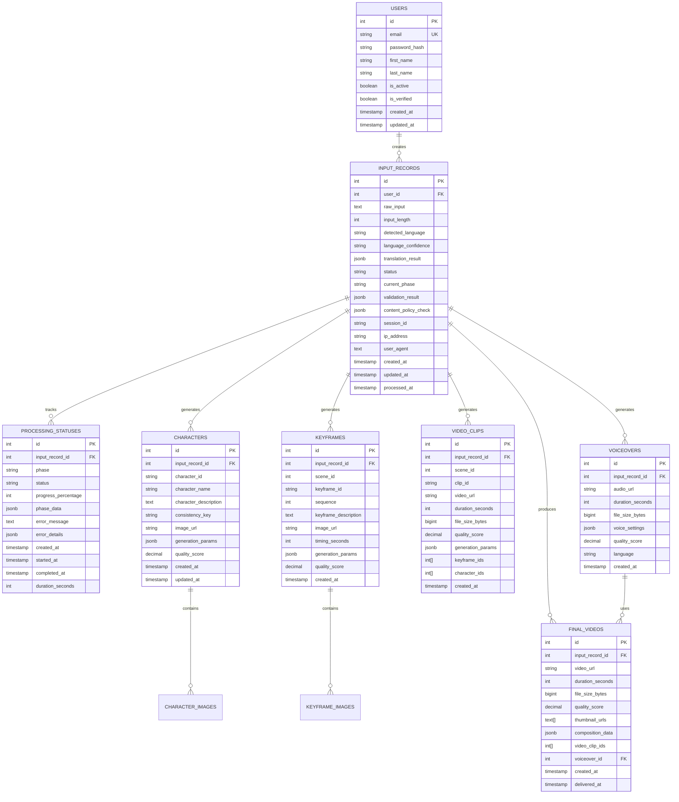

# Database Schema

## 🗄️ Database Overview

The CinBoard AI platform uses PostgreSQL as the primary database with Redis for caching. The database schema is designed to support the complete GenAI video generation workflow while maintaining data integrity, performance, and scalability.

### Database Architecture
- **Primary Database**: PostgreSQL 14+ with UTF-8 encoding
- **Cache Layer**: Redis 6+ for session management and performance optimization
- **File Storage**: AWS S3 for media files (images, videos, audio)
- **Backup Strategy**: Automated daily backups with point-in-time recovery

## 📊 Current Database Schema ✅ **IMPLEMENTED**

### Core Tables (Input Processing Service)

#### 1. Users Table
```sql
CREATE TABLE users (
    id SERIAL PRIMARY KEY,
    email VARCHAR(255) UNIQUE NOT NULL,
    password_hash VARCHAR(255) NOT NULL,
    first_name VARCHAR(100) NOT NULL,
    last_name VARCHAR(100) NOT NULL,
    is_active BOOLEAN DEFAULT TRUE,
    is_verified BOOLEAN DEFAULT FALSE,
    created_at TIMESTAMP WITH TIME ZONE DEFAULT CURRENT_TIMESTAMP,
    updated_at TIMESTAMP WITH TIME ZONE DEFAULT CURRENT_TIMESTAMP
);
```

**Purpose**: User authentication and profile management  
**Status**: ✅ Implemented  
**Key Features**:
- Unique email constraint
- Password hashing support
- User verification system
- Soft delete capability

#### 2. Input Records Table
```sql
CREATE TABLE input_records (
    id SERIAL PRIMARY KEY,
    user_id INTEGER NOT NULL REFERENCES users(id) ON DELETE CASCADE,
    raw_input TEXT NOT NULL,
    input_length INTEGER NOT NULL,
    detected_language VARCHAR(10),
    language_confidence VARCHAR(20), -- Fixed: VARCHAR(20) instead of FLOAT
    translation_result JSONB,
    status VARCHAR(50) DEFAULT 'pending',
    current_phase VARCHAR(50),
    validation_result JSONB,
    content_policy_check JSONB,
    session_id VARCHAR(255),
    ip_address VARCHAR(45),
    user_agent TEXT,
    created_at TIMESTAMP WITH TIME ZONE DEFAULT CURRENT_TIMESTAMP,
    updated_at TIMESTAMP WITH TIME ZONE DEFAULT CURRENT_TIMESTAMP,
    processed_at TIMESTAMP WITH TIME ZONE
);
```

**Purpose**: Store user input and processing metadata  
**Status**: ✅ Implemented  
**Key Features**:
- Unicode support for multilingual text
- JSONB for flexible metadata storage
- Comprehensive tracking (IP, user agent, session)
- Processing status tracking

#### 3. Processing Statuses Table
```sql
CREATE TABLE processing_statuses (
    id SERIAL PRIMARY KEY,
    input_record_id INTEGER NOT NULL REFERENCES input_records(id) ON DELETE CASCADE,
    phase VARCHAR(50) NOT NULL,
    status VARCHAR(50) NOT NULL,
    progress_percentage INTEGER DEFAULT 0,
    phase_data JSONB,
    error_message TEXT,
    error_details JSONB,
    created_at TIMESTAMP WITH TIME ZONE DEFAULT CURRENT_TIMESTAMP,
    started_at TIMESTAMP WITH TIME ZONE DEFAULT CURRENT_TIMESTAMP,
    completed_at TIMESTAMP WITH TIME ZONE,
    duration_seconds INTEGER
);
```

**Purpose**: Track processing phases and status  
**Status**: ✅ Implemented  
**Key Features**:
- Detailed phase tracking
- Error logging and debugging
- Performance metrics (duration)
- Flexible phase data storage

## 🔄 Extended Database Schema (GenAI Workflow)

### New Tables for Complete Video Generation Pipeline

#### 4. Characters Table ⚠️ **NEW REQUIREMENT**
```sql
CREATE TABLE characters (
    id SERIAL PRIMARY KEY,
    input_record_id INTEGER NOT NULL REFERENCES input_records(id) ON DELETE CASCADE,
    character_id VARCHAR(100) NOT NULL, -- Unique character identifier
    character_name VARCHAR(100) NOT NULL,
    character_description TEXT NOT NULL,
    consistency_key VARCHAR(100) NOT NULL, -- For maintaining consistency across scenes
    image_url VARCHAR(500),
    generation_params JSONB,
    quality_score DECIMAL(3,2), -- 0.00 to 1.00
    created_at TIMESTAMP WITH TIME ZONE DEFAULT CURRENT_TIMESTAMP,
    updated_at TIMESTAMP WITH TIME ZONE DEFAULT CURRENT_TIMESTAMP
);
```

**Purpose**: Store generated character information and images  
**Status**: ⚠️ New Requirement  
**Key Features**:
- Character consistency tracking
- Quality scoring system
- Generation parameter storage
- Image URL management

#### 5. Character Images Table ⚠️ **NEW REQUIREMENT**
```sql
CREATE TABLE character_images (
    id SERIAL PRIMARY KEY,
    character_id INTEGER NOT NULL REFERENCES characters(id) ON DELETE CASCADE,
    scene_id INTEGER, -- Reference to scene for context
    image_url VARCHAR(500) NOT NULL,
    image_type VARCHAR(50) DEFAULT 'character', -- character, variation, reference
    generation_params JSONB,
    quality_score DECIMAL(3,2),
    file_size_bytes BIGINT,
    created_at TIMESTAMP WITH TIME ZONE DEFAULT CURRENT_TIMESTAMP
);
```

**Purpose**: Store multiple character images for consistency  
**Status**: ⚠️ New Requirement  
**Key Features**:
- Multiple images per character
- Scene-specific context
- File size tracking
- Quality assessment

#### 6. Keyframes Table ⚠️ **NEW REQUIREMENT**
```sql
CREATE TABLE keyframes (
    id SERIAL PRIMARY KEY,
    input_record_id INTEGER NOT NULL REFERENCES input_records(id) ON DELETE CASCADE,
    scene_id INTEGER NOT NULL,
    keyframe_id VARCHAR(100) NOT NULL,
    sequence INTEGER NOT NULL, -- Order within scene (0, 1, 2)
    keyframe_description TEXT NOT NULL,
    image_url VARCHAR(500),
    timing_seconds INTEGER NOT NULL, -- Timing within scene
    generation_params JSONB,
    quality_score DECIMAL(3,2),
    created_at TIMESTAMP WITH TIME ZONE DEFAULT CURRENT_TIMESTAMP
);
```

**Purpose**: Store keyframe information for video generation  
**Status**: ⚠️ New Requirement  
**Key Features**:
- Scene-based organization
- Timing information
- Sequence tracking
- Quality scoring

#### 7. Keyframe Images Table ⚠️ **NEW REQUIREMENT**
```sql
CREATE TABLE keyframe_images (
    id SERIAL PRIMARY KEY,
    keyframe_id INTEGER NOT NULL REFERENCES keyframes(id) ON DELETE CASCADE,
    image_url VARCHAR(500) NOT NULL,
    image_type VARCHAR(50) DEFAULT 'keyframe',
    generation_params JSONB,
    quality_score DECIMAL(3,2),
    file_size_bytes BIGINT,
    created_at TIMESTAMP WITH TIME ZONE DEFAULT CURRENT_TIMESTAMP
);
```

**Purpose**: Store keyframe images with metadata  
**Status**: ⚠️ New Requirement  
**Key Features**:
- Image metadata storage
- Quality tracking
- File size monitoring

#### 8. Video Clips Table ⚠️ **NEW REQUIREMENT**
```sql
CREATE TABLE video_clips (
    id SERIAL PRIMARY KEY,
    input_record_id INTEGER NOT NULL REFERENCES input_records(id) ON DELETE CASCADE,
    scene_id INTEGER NOT NULL,
    clip_id VARCHAR(100) NOT NULL,
    video_url VARCHAR(500) NOT NULL,
    duration_seconds INTEGER NOT NULL,
    file_size_bytes BIGINT,
    quality_score DECIMAL(3,2),
    generation_params JSONB,
    keyframe_ids INTEGER[], -- Array of keyframe IDs used
    character_ids INTEGER[], -- Array of character IDs used
    created_at TIMESTAMP WITH TIME ZONE DEFAULT CURRENT_TIMESTAMP
);
```

**Purpose**: Store generated video clips  
**Status**: ⚠️ New Requirement  
**Key Features**:
- Scene-based organization
- Duration tracking
- File size monitoring
- Reference to source keyframes and characters

#### 9. Voiceovers Table ⚠️ **NEW REQUIREMENT**
```sql
CREATE TABLE voiceovers (
    id SERIAL PRIMARY KEY,
    input_record_id INTEGER NOT NULL REFERENCES input_records(id) ON DELETE CASCADE,
    audio_url VARCHAR(500) NOT NULL,
    duration_seconds INTEGER NOT NULL,
    file_size_bytes BIGINT,
    voice_settings JSONB NOT NULL,
    quality_score DECIMAL(3,2),
    language VARCHAR(10) NOT NULL,
    created_at TIMESTAMP WITH TIME ZONE DEFAULT CURRENT_TIMESTAMP
);
```

**Purpose**: Store generated voiceover audio  
**Status**: ⚠️ New Requirement  
**Key Features**:
- Voice settings storage
- Language tracking
- Quality assessment
- File size monitoring

#### 10. Final Videos Table ⚠️ **NEW REQUIREMENT**
```sql
CREATE TABLE final_videos (
    id SERIAL PRIMARY KEY,
    input_record_id INTEGER NOT NULL REFERENCES input_records(id) ON DELETE CASCADE,
    video_url VARCHAR(500) NOT NULL,
    duration_seconds INTEGER NOT NULL,
    file_size_bytes BIGINT,
    quality_score DECIMAL(3,2),
    thumbnail_urls TEXT[], -- Array of thumbnail URLs
    composition_data JSONB, -- Video composition metadata
    video_clip_ids INTEGER[], -- Array of video clip IDs used
    voiceover_id INTEGER REFERENCES voiceovers(id),
    created_at TIMESTAMP WITH TIME ZONE DEFAULT CURRENT_TIMESTAMP,
    delivered_at TIMESTAMP WITH TIME ZONE
);
```

**Purpose**: Store final composed videos  
**Status**: ⚠️ New Requirement  
**Key Features**:
- Complete video metadata
- Thumbnail management
- Composition tracking
- Delivery status

## 🔗 Entity Relationship Diagram



## 📈 Database Indexes and Performance

### Current Indexes ✅ **IMPLEMENTED**
```sql
-- Performance indexes
CREATE INDEX idx_users_email ON users(email);
CREATE INDEX idx_input_records_user_id ON input_records(user_id);
CREATE INDEX idx_input_records_status ON input_records(status);
CREATE INDEX idx_input_records_created_at ON input_records(created_at);
CREATE INDEX idx_processing_statuses_input_record_id ON processing_statuses(input_record_id);
CREATE INDEX idx_processing_statuses_phase ON processing_statuses(phase);
CREATE INDEX idx_processing_statuses_status ON processing_statuses(status);
```

### Additional Indexes for GenAI Workflow ⚠️ **NEW REQUIREMENT**
```sql
-- Character indexes
CREATE INDEX idx_characters_input_record_id ON characters(input_record_id);
CREATE INDEX idx_characters_consistency_key ON characters(consistency_key);
CREATE INDEX idx_character_images_character_id ON character_images(character_id);

-- Keyframe indexes
CREATE INDEX idx_keyframes_input_record_id ON keyframes(input_record_id);
CREATE INDEX idx_keyframes_scene_id ON keyframes(scene_id);
CREATE INDEX idx_keyframe_images_keyframe_id ON keyframe_images(keyframe_id);

-- Video clip indexes
CREATE INDEX idx_video_clips_input_record_id ON video_clips(input_record_id);
CREATE INDEX idx_video_clips_scene_id ON video_clips(scene_id);

-- Voiceover indexes
CREATE INDEX idx_voiceovers_input_record_id ON voiceovers(input_record_id);
CREATE INDEX idx_voiceovers_language ON voiceovers(language);

-- Final video indexes
CREATE INDEX idx_final_videos_input_record_id ON final_videos(input_record_id);
CREATE INDEX idx_final_videos_delivered_at ON final_videos(delivered_at);
```

## 🔄 Database Triggers and Functions

### Automatic Timestamp Updates ✅ **IMPLEMENTED**
```sql
-- Function to update updated_at timestamp
CREATE OR REPLACE FUNCTION update_updated_at_column()
RETURNS TRIGGER AS $$
BEGIN
    NEW.updated_at = CURRENT_TIMESTAMP;
    RETURN NEW;
END;
$$ language 'plpgsql';

-- Triggers for updated_at
CREATE TRIGGER update_users_updated_at BEFORE UPDATE ON users
    FOR EACH ROW EXECUTE FUNCTION update_updated_at_column();

CREATE TRIGGER update_input_records_updated_at BEFORE UPDATE ON input_records
    FOR EACH ROW EXECUTE FUNCTION update_updated_at_column();

CREATE TRIGGER update_characters_updated_at BEFORE UPDATE ON characters
    FOR EACH ROW EXECUTE FUNCTION update_updated_at_column();
```

### Quality Score Validation ⚠️ **NEW REQUIREMENT**
```sql
-- Function to validate quality scores
CREATE OR REPLACE FUNCTION validate_quality_score()
RETURNS TRIGGER AS $$
BEGIN
    IF NEW.quality_score < 0.0 OR NEW.quality_score > 1.0 THEN
        RAISE EXCEPTION 'Quality score must be between 0.0 and 1.0';
    END IF;
    RETURN NEW;
END;
$$ language 'plpgsql';

-- Triggers for quality score validation
CREATE TRIGGER validate_character_quality_score BEFORE INSERT OR UPDATE ON characters
    FOR EACH ROW EXECUTE FUNCTION validate_quality_score();

CREATE TRIGGER validate_keyframe_quality_score BEFORE INSERT OR UPDATE ON keyframes
    FOR EACH ROW EXECUTE FUNCTION validate_quality_score();

CREATE TRIGGER validate_video_clip_quality_score BEFORE INSERT OR UPDATE ON video_clips
    FOR EACH ROW EXECUTE FUNCTION validate_quality_score();
```

## 🗃️ Redis Cache Schema

### Cache Key Patterns
```
# Translation cache
translation:{text_hash}:{source_lang}:{target_lang} -> TranslationResult

# Character cache
character:{character_hash} -> CharacterImage
character:consistency:{consistency_key} -> CharacterConsistencyData

# Keyframe cache
keyframe:{keyframe_hash} -> KeyframeImage
keyframe:scene:{scene_id} -> List[KeyframeImage]

# Video cache
video:clip:{clip_id} -> VideoClip
video:scene:{scene_id} -> List[VideoClip]

# Voiceover cache
voiceover:{text_hash}:{voice_settings} -> AudioFile
voiceover:language:{language} -> VoiceSettings

# Status cache
status:{input_id} -> ProcessingStatus
status:phase:{input_id}:{phase} -> PhaseStatus

# User session cache
session:{session_id} -> UserSession
user:{user_id}:active_sessions -> List[SessionId]
```

### Cache TTL Configuration
```python
CACHE_TTL = {
    'translation': 3600,        # 1 hour
    'character': 7200,          # 2 hours
    'keyframe': 1800,           # 30 minutes
    'video_clip': 3600,        # 1 hour
    'voiceover': 1800,          # 30 minutes
    'status': 300,              # 5 minutes
    'session': 1800,            # 30 minutes
    'user_sessions': 3600       # 1 hour
}
```

## 🔒 Data Security and Privacy

### Encryption
- **At Rest**: Database encryption using PostgreSQL TDE
- **In Transit**: TLS/SSL for all database connections
- **Sensitive Data**: Password hashing using bcrypt
- **API Keys**: Encrypted storage in environment variables

### Access Control
- **Database Users**: Role-based access control
- **API Access**: JWT token authentication
- **Admin Access**: Multi-factor authentication
- **Audit Logging**: Comprehensive access logging

### Data Retention
- **User Data**: Retained per user request or legal requirements
- **Processing Data**: Retained for 90 days for debugging
- **Media Files**: Retained per user subscription tier
- **Audit Logs**: Retained for 1 year for compliance

## 📊 Database Monitoring

### Performance Metrics
- **Query Performance**: Slow query logging and analysis
- **Connection Pooling**: Connection usage monitoring
- **Index Usage**: Index efficiency analysis
- **Cache Hit Rates**: Redis cache performance

### Health Checks
- **Database Connectivity**: Automated health checks
- **Replication Status**: Master-slave replication monitoring
- **Disk Space**: Storage usage monitoring
- **Backup Status**: Backup completion verification

## 🚀 Migration Strategy

### Phase 1: Current Schema ✅ **IMPLEMENTED**
- Users, Input Records, Processing Statuses tables
- Basic indexes and triggers
- Redis cache implementation

### Phase 2: GenAI Workflow Tables ⚠️ **NEW REQUIREMENT**
- Characters, Keyframes, Video Clips tables
- Voiceovers, Final Videos tables
- Extended indexes and triggers
- Cache schema updates

### Phase 3: Optimization and Scaling 🔄 **PLANNED**
- Partitioning for large tables
- Read replicas for scaling
- Advanced caching strategies
- Performance optimization

---

This database schema provides a comprehensive foundation for the complete GenAI video generation workflow while maintaining data integrity, performance, and scalability.
