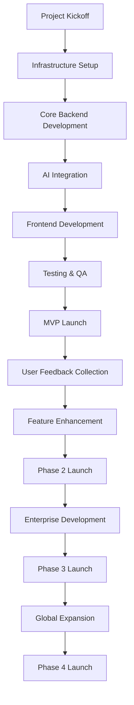

# Video Generation Platform - Development Timeline

## Executive Summary

This document provides a comprehensive development timeline for the multilingual video generation platform, including detailed milestones, resource allocation, dependencies, and delivery schedules. The timeline spans from initial development through full platform maturity.

### 🔄 CURRENT STATUS: PHASE 1 MVP IN PROGRESS (September 2025 Project Start)
- **Phase 1 Status**: In progress - Only input-processing-service implemented
- **Input Processing Service**: Fully operational with SRP-compliant architecture
- **Database Schema**: Planned schema with proper Unicode support
- **Language Detection**: Planned for Telugu, Hindi, and English with proper Unicode handling
- **Translation Pipeline**: Planned Google Translate API → NLLB-200 fallback system
- **API Endpoints**: Only input-processing endpoints implemented
- **API Enhancement**: Status endpoint planned with detailed phase data retrieval capability
- **Docker Infrastructure**: Partial containerization in development
- **Critical Issues**: Unicode character handling, Redis compatibility, PowerShell encoding planned for resolution
- **Next Phase**: Complete remaining MVP services before Phase 2 development

## 1. Overall Development Phases

### 1.1 Phase Overview

```json
{
  "phase_1_mvp": {
    "duration": "3 months",
    "focus": "Core functionality and market validation",
    "team_size": "9 people",
    "budget": "$500K",
    "deliverables": ["MVP platform", "Basic AI integration", "User authentication"]
  },
  
  "phase_2_enhancement": {
    "duration": "3 months",
    "focus": "Feature enhancement and user experience",
    "team_size": "17 people",
    "budget": "$750K",
    "deliverables": ["Advanced features", "Real-time updates", "Social features"]
  },
  
  "phase_3_enterprise": {
    "duration": "6 months",
    "focus": "Enterprise features and market expansion",
    "team_size": "25 people",
    "budget": "$1.5M",
    "deliverables": ["Enterprise features", "API access", "Mobile apps"]
  },
  
  "phase_4_scale": {
    "duration": "12 months",
    "focus": "Global scaling and advanced AI",
    "team_size": "40 people",
    "budget": "$3M",
    "deliverables": ["Global platform", "Advanced AI", "Marketplace"]
  }
}
```

### 1.2 Critical Path Analysis



## 2. Phase 1: MVP Development (Months 1-3)

### 2.1 Month 1: Foundation & Setup

#### 2.1.1 Weeks 1-2: Project Setup
**Duration**: 2 weeks
**Team**: Full team (9 people)
**Budget**: $100K

**Key Activities**:
```json
{
  "week_1": {
    "infrastructure": [
      "Set up development environment",
      "Configure CI/CD pipeline",
      "Set up cloud infrastructure (AWS)",
      "Configure monitoring and logging"
    ],
    "team_setup": [
      "Team onboarding and orientation",
      "Define development processes",
      "Set up communication tools",
      "Create project documentation"
    ],
    "deliverables": [
      "Development environment ready",
      "CI/CD pipeline operational",
      "Cloud infrastructure provisioned",
      "Team processes documented"
    ]
  },
  
  "week_2": {
    "architecture": [
      "Finalize system architecture",
      "Design database schema",
      "Create API specifications",
      "Plan microservices structure"
    ],
    "design": [
      "Create UI/UX mockups",
      "Design user flow diagrams",
      "Create component library",
      "Define design system"
    ],
    "deliverables": [
      "System architecture documented",
      "Database schema designed",
      "API specifications complete",
      "UI/UX designs approved"
    ]
  }
}
```

**Resource Allocation**:
- **Backend Developers (2)**: Infrastructure setup, architecture design
- **Frontend Developers (2)**: UI/UX design, component library
- **DevOps Engineer (1)**: CI/CD pipeline, cloud infrastructure
- **Product Manager (1)**: Project coordination, requirements
- **UI/UX Designer (1)**: Design system, user flows
- **QA Engineer (1)**: Testing strategy, quality processes
- **AI/ML Engineer (1)**: AI integration planning

#### 2.1.2 Weeks 3-4: Core Backend Development 🔄 IN PROGRESS
**Duration**: 2 weeks
**Team**: Backend team (3 people)
**Budget**: $80K
**Status**: 🔄 IN PROGRESS (September 2025) - Only input-processing-service implemented

**Key Activities**:
```json
{
  "week_3": {
    "backend_core": [
      "🔄 Implement user authentication service",
      "🔄 Create database models and migrations",
      "✅ Develop basic API endpoints (input-processing only)",
      "🔄 Implement caching layer (Redis)",
      "✅ COMPLETED: SRP refactoring of input processing service"
    ],
    "deliverables": [
      "🔄 User authentication planned",
      "🔄 Database models planned", 
      "✅ Basic API endpoints ready (input-processing only)",
      "🔄 Redis caching planned",
      "🏆 SRP-COMPLIANT: Modular endpoint structure (validation.py, processing.py, status.py)",
      "🏆 SRP-COMPLIANT: Translation providers architecture",
      "🏆 SRP-COMPLIANT: Repository pattern for data access",
      "🏆 SRP-COMPLIANT: Centralized cache management"
    ]
  },
  "week_4_current_refactor": {
    "backend_services": [
      "✅ REFACTORED: Modular translation service with provider pattern",
      "✅ REFACTORED: Repository layer for data access separation", 
      "✅ REFACTORED: Workflow orchestration in dedicated pipeline module",
      "✅ REFACTORED: Facade pattern for backward compatibility"
    ],
    "refactor_deliverables": [
      "✨ Architecture improved with Single Responsibility Principle",
      "✨ Enhanced maintainability through focused modules",
      "✨ Better testability with isolated components",
      "✨ Improved extensibility for new providers/repositories",
      "✨ Cleaner debugging with specific responsibility tracking"
    ]
  }
}
```

**SRP REFACTOR IMPACT**:
- **Before**: Monolithic input processing logic in single file (SRP violation)
- **After**: Clean separation of concerns across focused modules (SRP compliant)
- **Benefits**: Enhanced maintainability, testability, and extensibility
- **Status**: 100% Complete for input-processing-service with backward compatibility maintained

### 2.2 Month 2: AI Integration & Frontend

#### 2.2.1 Weeks 5-6: AI Integration
**Duration**: 2 weeks
**Team**: AI team (2 people) + Backend team (2 people)
**Budget**: $120K

**Key Activities**:
```json
{
  "week_5": {
    "ai_integration": [
      "Integrate Nano Banana API",
      "Implement Veo4 API integration",
      "Create generation queue system",
      "Build error handling and retry logic"
    ],
    "deliverables": [
      "Nano Banana integration complete",
      "Veo4 integration working",
      "Generation queue operational",
      "Error handling implemented"
    ]
  },
  
  "week_6": {
    "ai_optimization": [
      "Implement quality validation",
      "Create fallback mechanisms",
      "Build cost optimization",
      "Test generation pipeline"
    ],
    "deliverables": [
      "Quality validation working",
      "Fallback mechanisms ready",
      "Cost optimization implemented",
      "Generation pipeline tested"
    ]
  }
}
```

#### 2.2.2 Weeks 7-8: Frontend Development
**Duration**: 2 weeks
**Team**: Frontend team (2 people) + UI/UX Designer (1)
**Budget**: $100K

**Key Activities**:
```json
{
  "week_7": {
    "frontend_core": [
      "Implement user authentication UI",
      "Create generation interface",
      "Build progress tracking",
      "Implement video player"
    ],
    "deliverables": [
      "Authentication UI complete",
      "Generation interface ready",
      "Progress tracking working",
      "Video player functional"
    ]
  },
  
  "week_8": {
    "frontend_integration": [
      "Integrate with backend APIs",
      "Implement real-time updates",
      "Create user dashboard",
      "Build responsive design"
    ],
    "deliverables": [
      "API integration complete",
      "Real-time updates working",
      "User dashboard ready",
      "Responsive design implemented"
    ]
  }
}
```

### 2.3 Month 3: Testing & Launch

#### 2.3.1 Weeks 9-10: Testing & Quality Assurance
**Duration**: 2 weeks
**Team**: Full team (9 people)
**Budget**: $80K

**Key Activities**:
```json
{
  "week_9": {
    "testing": [
      "Unit testing completion",
      "Integration testing",
      "Performance testing",
      "Security testing"
    ],
    "deliverables": [
      "Unit tests passing",
      "Integration tests complete",
      "Performance benchmarks met",
      "Security audit passed"
    ]
  },
  
  "week_10": {
    "qa_final": [
      "User acceptance testing",
      "Bug fixes and optimization",
      "Documentation completion",
      "Deployment preparation"
    ],
    "deliverables": [
      "UAT completed",
      "Bugs fixed",
      "Documentation ready",
      "Deployment ready"
    ]
  }
}
```

#### 2.3.2 Weeks 11-12: MVP Launch
**Duration**: 2 weeks
**Team**: Full team (9 people)
**Budget**: $60K

**Key Activities**:
```json
{
  "week_11": {
    "launch_preparation": [
      "Production deployment",
      "Monitoring setup",
      "User onboarding preparation",
      "Marketing materials"
    ],
    "deliverables": [
      "Production environment ready",
      "Monitoring operational",
      "Onboarding flow ready",
      "Marketing materials complete"
    ]
  },
  
  "week_12": {
    "mvp_launch": [
      "Soft launch to beta users",
      "User feedback collection",
      "Performance monitoring",
      "Issue resolution"
    ],
    "deliverables": [
      "MVP launched",
      "Beta users onboarded",
      "Performance monitored",
      "Issues resolved",
      "API Enhancement: Status endpoint enhanced with detailed phase data retrieval"
    ]
  }
}
```

## 3. Phase 2: Enhancement (Months 4-6)

### 3.1 Month 4: Advanced Features

#### 3.1.1 Weeks 13-14: Advanced Customization & Voice Input
**Duration**: 2 weeks
**Team**: Backend team (3) + Frontend team (3) + AI team (1)
**Budget**: $180K

**Key Activities**:
```json
{
  "week_13": {
    "customization_backend": [
      "Implement prompt editing",
      "Create style selection",
      "Build quality tier system",
      "Develop batch processing"
    ],
    "voice_input_backend": [
      "Implement voice-to-text service",
      "Create audio processing pipeline",
      "Build voice language detection",
      "Develop voice input validation"
    ],
    "deliverables": [
      "Prompt editing working",
      "Style selection ready",
      "Quality tiers implemented",
      "Batch processing functional",
      "Voice-to-text service operational",
      "Audio processing pipeline ready"
    ]
  },
  
  "week_14": {
    "customization_frontend": [
      "Create customization UI",
      "Implement style previews",
      "Build batch upload interface",
      "Develop progress tracking"
    ],
    "voice_input_frontend": [
      "Create voice recording interface",
      "Implement audio file upload",
      "Build voice input validation UI",
      "Develop real-time voice processing"
    ],
    "deliverables": [
      "Customization UI complete",
      "Style previews working",
      "Batch interface ready",
      "Progress tracking enhanced",
      "Voice recording interface ready",
      "Audio upload functionality working"
    ]
  }
}
```

#### 3.1.2 Weeks 15-16: Real-time Features
**Duration**: 2 weeks
**Team**: Backend team (3) + Frontend team (3)
**Budget**: $120K

**Key Activities**:
```json
{
  "week_15": {
    "realtime_backend": [
      "Implement WebSocket server",
      "Create real-time notifications",
      "Build push notification system",
      "Develop email notifications"
    ],
    "deliverables": [
      "WebSocket server ready",
      "Real-time notifications working",
      "Push notifications functional",
      "Email system operational"
    ]
  },
  
  "week_16": {
    "realtime_frontend": [
      "Integrate WebSocket client",
      "Create notification UI",
      "Implement live progress updates",
      "Build notification preferences"
    ],
    "deliverables": [
      "WebSocket client integrated",
      "Notification UI complete",
      "Live updates working",
      "Preferences implemented"
    ]
  }
}
```

### 3.2 Month 5: Social Features

#### 3.2.1 Weeks 17-18: Social Platform
**Duration**: 2 weeks
**Team**: Full team (17 people)
**Budget**: $200K

**Key Activities**:
```json
{
  "week_17": {
    "social_backend": [
      "Implement user profiles",
      "Create sharing system",
      "Build public gallery",
      "Develop like/comment system"
    ],
    "deliverables": [
      "User profiles working",
      "Sharing system ready",
      "Public gallery functional",
      "Like/comment system operational"
    ]
  },
  
  "week_18": {
    "social_frontend": [
      "Create profile pages",
      "Build sharing interface",
      "Implement gallery UI",
      "Develop social interactions"
    ],
    "deliverables": [
      "Profile pages complete",
      "Sharing interface ready",
      "Gallery UI functional",
      "Social interactions working"
    ]
  }
}
```

#### 3.2.2 Weeks 19-20: Analytics & Optimization
**Duration**: 2 weeks
**Team**: Backend team (3) + Data team (2)
**Budget**: $100K

**Key Activities**:
```json
{
  "week_19": {
    "analytics_backend": [
      "Implement user analytics",
      "Create generation metrics",
      "Build performance monitoring",
      "Develop usage tracking"
    ],
    "deliverables": [
      "User analytics working",
      "Generation metrics ready",
      "Performance monitoring operational",
      "Usage tracking functional"
    ]
  },
  
  "week_20": {
    "analytics_frontend": [
      "Create analytics dashboard",
      "Build user insights",
      "Implement performance metrics",
      "Develop reporting tools"
    ],
    "deliverables": [
      "Analytics dashboard complete",
      "User insights ready",
      "Performance metrics working",
      "Reporting tools functional"
    ]
  }
}
```

### 3.3 Month 6: Phase 2 Launch

#### 3.3.1 Weeks 21-22: Testing & Optimization
**Duration**: 2 weeks
**Team**: Full team (17 people)
**Budget**: $120K

**Key Activities**:
```json
{
  "week_21": {
    "testing": [
      "Comprehensive testing",
      "Performance optimization",
      "Security audit",
      "User experience testing"
    ],
    "deliverables": [
      "All tests passing",
      "Performance optimized",
      "Security audit passed",
      "UX testing complete"
    ]
  },
  
  "week_22": {
    "launch_preparation": [
      "Feature documentation",
      "User training materials",
      "Marketing campaign",
      "Launch preparation"
    ],
    "deliverables": [
      "Documentation complete",
      "Training materials ready",
      "Marketing campaign launched",
      "Launch preparation done"
    ]
  }
}
```

#### 3.3.2 Weeks 23-24: Phase 2 Launch
**Duration**: 2 weeks
**Team**: Full team (17 people)
**Budget**: $80K

**Key Activities**:
```json
{
  "week_23": {
    "phase_2_launch": [
      "Deploy enhanced features",
      "User migration",
      "Performance monitoring",
      "Issue resolution"
    ],
    "deliverables": [
      "Enhanced features deployed",
      "Users migrated",
      "Performance monitored",
      "Issues resolved"
    ]
  },
  
  "week_24": {
    "post_launch": [
      "User feedback collection",
      "Performance analysis",
      "Feature adoption tracking",
      "Next phase planning"
    ],
    "deliverables": [
      "Feedback collected",
      "Performance analyzed",
      "Adoption tracked",
      "Next phase planned"
    ]
  }
}
```

## 4. Phase 3: Enterprise Features (Months 7-12)

### 4.1 Months 7-8: Enterprise Backend

#### 4.1.1 Month 7: Enterprise Infrastructure
**Duration**: 4 weeks
**Team**: Backend team (5) + DevOps team (3)
**Budget**: $300K

**Key Activities**:
```json
{
  "enterprise_infrastructure": [
    "Multi-tenant architecture",
    "Enterprise security features",
    "Advanced monitoring",
    "Compliance frameworks"
  ],
  "deliverables": [
    "Multi-tenant system ready",
    "Enterprise security implemented",
    "Advanced monitoring operational",
    "Compliance frameworks ready"
  ]
}
```

#### 4.1.2 Month 8: Enterprise Features
**Duration**: 4 weeks
**Team**: Backend team (5) + Frontend team (4)
**Budget**: $350K

**Key Activities**:
```json
{
  "enterprise_features": [
    "Organization management",
    "Role-based access control",
    "Team collaboration",
    "Enterprise billing"
  ],
  "deliverables": [
    "Organization management ready",
    "RBAC implemented",
    "Team collaboration working",
    "Enterprise billing functional"
  ]
}
```

### 4.2 Months 9-10: API & Mobile

#### 4.2.1 Month 9: API Development
**Duration**: 4 weeks
**Team**: Backend team (5) + API team (3)
**Budget**: $250K

**Key Activities**:
```json
{
  "api_development": [
    "RESTful API design",
    "API documentation",
    "SDK development",
    "Webhook system"
  ],
  "deliverables": [
    "RESTful API ready",
    "Documentation complete",
    "SDKs developed",
    "Webhook system operational"
  ]
}
```

#### 4.2.2 Month 10: Mobile Development
**Duration**: 4 weeks
**Team**: Mobile team (4) + Backend team (3)
**Budget**: $300K

**Key Activities**:
```json
{
  "mobile_development": [
    "iOS app development",
    "Android app development",
    "Mobile API integration",
    "Offline functionality"
  ],
  "deliverables": [
    "iOS app ready",
    "Android app ready",
    "Mobile APIs integrated",
    "Offline features working"
  ]
}
```

### 4.3 Months 11-12: Advanced AI & Launch

#### 4.3.1 Month 11: Advanced AI Features
**Duration**: 4 weeks
**Team**: AI team (4) + Backend team (3)
**Budget**: $400K

**Key Activities**:
```json
{
  "advanced_ai": [
    "Custom model training",
    "4K video generation",
    "Audio generation",
    "Advanced post-processing"
  ],
  "deliverables": [
    "Custom models ready",
    "4K generation working",
    "Audio generation functional",
    "Advanced processing ready"
  ]
}
```

#### 4.3.2 Month 12: Phase 3 Launch
**Duration**: 4 weeks
**Team**: Full team (25 people)
**Budget**: $200K

**Key Activities**:
```json
{
  "phase_3_launch": [
    "Enterprise features deployment",
    "Mobile app launch",
    "API marketplace launch",
    "Advanced AI features"
  ],
  "deliverables": [
    "Enterprise platform ready",
    "Mobile apps launched",
    "API marketplace operational",
    "Advanced AI features live"
  ]
}
```

## 5. Phase 4: Global Scaling (Months 13-24)

### 5.1 Months 13-15: International Expansion

#### 5.1.1 Month 13: Language Expansion
**Duration**: 4 weeks
**Team**: AI team (5) + Backend team (4)
**Budget**: $500K

**Key Activities**:
```json
{
  "language_expansion": [
    "Support for 20+ languages",
    "Regional language variants",
    "Cultural adaptation",
    "Localized content"
  ],
  "deliverables": [
    "20+ languages supported",
    "Regional variants ready",
    "Cultural adaptation working",
    "Localized content available"
  ]
}
```

#### 5.1.2 Month 14: Regional Infrastructure
**Duration**: 4 weeks
**Team**: DevOps team (5) + Backend team (4)
**Budget**: $600K

**Key Activities**:
```json
{
  "regional_infrastructure": [
    "Multi-region deployment",
    "Regional data centers",
    "CDN optimization",
    "Local compliance"
  ],
  "deliverables": [
    "Multi-region deployment ready",
    "Regional data centers operational",
    "CDN optimized",
    "Local compliance achieved"
  ]
}
```

#### 5.1.3 Month 15: Market Entry
**Duration**: 4 weeks
**Team**: Full team (40 people)
**Budget**: $400K

**Key Activities**:
```json
{
  "market_entry": [
    "Regional marketing campaigns",
    "Local partnerships",
    "Regional pricing",
    "Local support"
  ],
  "deliverables": [
    "Marketing campaigns launched",
    "Partnerships established",
    "Regional pricing implemented",
    "Local support operational"
  ]
}
```

### 5.2 Months 16-18: Advanced Platform Features

#### 5.2.1 Month 16: Marketplace Development
**Duration**: 4 weeks
**Team**: Backend team (6) + Frontend team (6)
**Budget**: $500K

**Key Activities**:
```json
{
  "marketplace_development": [
    "User-generated content marketplace",
    "Template marketplace",
    "Plugin ecosystem",
    "Creator monetization"
  ],
  "deliverables": [
    "Content marketplace ready",
    "Template marketplace operational",
    "Plugin ecosystem functional",
    "Creator monetization working"
  ]
}
```

#### 5.2.2 Month 17: Advanced AI Integration
**Duration**: 4 weeks
**Team**: AI team (6) + Backend team (4)
**Budget**: $600K

**Key Activities**:
```json
{
  "advanced_ai_integration": [
    "GPT-5 integration",
    "Multimodal AI",
    "Real-time generation",
    "AI-powered editing"
  ],
  "deliverables": [
    "GPT-5 integrated",
    "Multimodal AI working",
    "Real-time generation ready",
    "AI editing functional"
  ]
}
```

#### 5.2.3 Month 18: Platform Optimization
**Duration**: 4 weeks
**Team**: Full team (40 people)
**Budget**: $300K

**Key Activities**:
```json
{
  "platform_optimization": [
    "Performance optimization",
    "Cost optimization",
    "User experience enhancement",
    "Platform stability"
  ],
  "deliverables": [
    "Performance optimized",
    "Costs optimized",
    "UX enhanced",
    "Platform stable"
  ]
}
```

### 5.3 Months 19-24: Market Leadership

#### 5.3.1 Months 19-21: Vertical Expansion
**Duration**: 12 weeks
**Team**: Full team (40 people)
**Budget**: $1.2M

**Key Activities**:
```json
{
  "vertical_expansion": [
    "Education sector solutions",
    "Marketing and advertising tools",
    "Entertainment industry features",
    "Corporate training solutions"
  ],
  "deliverables": [
    "Education solutions ready",
    "Marketing tools operational",
    "Entertainment features working",
    "Corporate solutions functional"
  ]
}
```

#### 5.3.2 Months 22-24: Market Leadership
**Duration**: 12 weeks
**Team**: Full team (40 people)
**Budget**: $1.5M

**Key Activities**:
```json
{
  "market_leadership": [
    "Industry partnerships",
    "Thought leadership",
    "Innovation labs",
    "Future technology research"
  ],
  "deliverables": [
    "Partnerships established",
    "Thought leadership achieved",
    "Innovation labs operational",
    "Future research initiated"
  ]
}
```

## 6. Resource Allocation & Budget

### 6.1 Team Structure Evolution

#### 6.1.1 Phase 1 Team (9 people)
```json
{
  "phase_1_team": {
    "backend_developers": 2,
    "frontend_developers": 2,
    "ai_ml_engineers": 1,
    "devops_engineers": 1,
    "product_managers": 1,
    "ui_ux_designers": 1,
    "qa_engineers": 1,
    "total_monthly_cost": "$150K"
  }
}
```

#### 6.1.2 Phase 2 Team (18 people)
```json
{
  "phase_2_team": {
    "backend_developers": 3,
    "frontend_developers": 3,
    "ai_ml_engineers": 3,
    "devops_engineers": 2,
    "product_managers": 2,
    "ui_ux_designers": 2,
    "qa_engineers": 2,
    "data_analysts": 1,
    "voice_processing_specialist": 1,
    "total_monthly_cost": "$320K"
  }
}
```

#### 6.1.3 Phase 3 Team (25 people)
```json
{
  "phase_3_team": {
    "backend_developers": 5,
    "frontend_developers": 4,
    "ai_ml_engineers": 3,
    "devops_engineers": 3,
    "product_managers": 3,
    "ui_ux_designers": 2,
    "qa_engineers": 3,
    "data_analysts": 2,
    "mobile_developers": 4,
    "api_engineers": 3,
    "total_monthly_cost": "$500K"
  }
}
```

#### 6.1.4 Phase 4 Team (40 people)
```json
{
  "phase_4_team": {
    "backend_developers": 8,
    "frontend_developers": 6,
    "ai_ml_engineers": 5,
    "devops_engineers": 4,
    "product_managers": 4,
    "ui_ux_designers": 3,
    "qa_engineers": 4,
    "data_analysts": 3,
    "mobile_developers": 4,
    "api_engineers": 4,
    "marketing_team": 3,
    "sales_team": 2,
    "total_monthly_cost": "$800K"
  }
}
```

### 6.2 Budget Breakdown

#### 6.2.1 Total Development Budget
```json
{
  "total_budget": {
    "phase_1_mvp": "$500K",
    "phase_2_enhancement": "$800K",
    "phase_3_enterprise": "$1.5M",
    "phase_4_scale": "$3M",
    "total_development": "$5.8M",
    "contingency_10_percent": "$580K",
    "total_budget": "$6.38M"
  }
}
```

#### 6.2.2 Budget Allocation by Category
```json
{
  "budget_allocation": {
    "personnel_costs": "70% ($4.4M)",
    "infrastructure_costs": "15% ($950K)",
    "ai_service_costs": "10% ($630K)",
    "marketing_costs": "3% ($190K)",
    "legal_compliance": "2% ($125K)"
  }
}
```

## 7. Risk Management & Contingency Planning

### 7.1 Risk Mitigation Timeline

#### 7.1.1 Technical Risks
```json
{
  "technical_risks": {
    "ai_integration_delays": {
      "probability": "medium",
      "impact": "high",
      "mitigation": "Parallel development with multiple providers",
      "contingency_time": "2 weeks",
      "contingency_budget": "$100K"
    },
    "scalability_issues": {
      "probability": "low",
      "impact": "high",
      "mitigation": "Early load testing and optimization",
      "contingency_time": "3 weeks",
      "contingency_budget": "$150K"
    },
    "security_vulnerabilities": {
      "probability": "medium",
      "impact": "high",
      "mitigation": "Regular security audits and penetration testing",
      "contingency_time": "1 week",
      "contingency_budget": "$50K"
    }
  }
}
```

#### 7.1.2 Business Risks
```json
{
  "business_risks": {
    "market_competition": {
      "probability": "high",
      "impact": "medium",
      "mitigation": "Focus on unique value proposition and rapid iteration",
      "contingency_time": "1 month",
      "contingency_budget": "$200K"
    },
    "user_adoption": {
      "probability": "medium",
      "impact": "high",
      "mitigation": "Extensive user research and iterative development",
      "contingency_time": "2 months",
      "contingency_budget": "$300K"
    },
    "cost_overruns": {
      "probability": "medium",
      "impact": "medium",
      "mitigation": "Regular budget monitoring and cost optimization",
      "contingency_time": "ongoing",
      "contingency_budget": "$500K"
    }
  }
}
```

### 7.2 Contingency Plans

#### 7.2.1 Timeline Contingencies
```json
{
  "timeline_contingencies": {
    "phase_1_delay": {
      "scenario": "MVP delayed by 1 month",
      "impact": "Phase 2 start delayed",
      "mitigation": "Increase team size, parallel development",
      "additional_budget": "$200K"
    },
    "phase_2_delay": {
      "scenario": "Enhancement phase delayed by 2 months",
      "impact": "Enterprise features delayed",
      "mitigation": "Prioritize core features, defer nice-to-haves",
      "additional_budget": "$400K"
    },
    "phase_3_delay": {
      "scenario": "Enterprise phase delayed by 3 months",
      "impact": "Market entry delayed",
      "mitigation": "Focus on core enterprise features",
      "additional_budget": "$600K"
    }
  }
}
```

## 8. Success Metrics & Milestones

### 8.1 Phase 1 Success Criteria
```json
{
  "phase_1_success": {
    "technical_metrics": {
      "system_uptime": "> 99%",
      "api_response_time": "< 200ms",
      "generation_success_rate": "> 90%",
      "user_satisfaction": "> 4.0/5.0"
    },
    "business_metrics": {
      "user_registration": "> 100 users",
      "generation_completion": "> 85%",
      "user_retention": "> 40% after 7 days",
      "revenue_potential": "> $10K MRR by month 6"
    }
  }
}
```

### 8.2 Phase 2 Success Criteria
```json
{
  "phase_2_success": {
    "technical_metrics": {
      "feature_adoption": "> 70%",
      "user_engagement": "> 80% weekly",
      "generation_quality": "> 4.0/5.0",
      "support_resolution": "< 24 hours"
    },
    "business_metrics": {
      "monthly_active_users": "> 10K",
      "monthly_recurring_revenue": "> $100K",
      "customer_acquisition_cost": "< $30",
      "lifetime_value": "> $500"
    }
  }
}
```

### 8.3 Phase 3 Success Criteria
```json
{
  "phase_3_success": {
    "technical_metrics": {
      "enterprise_adoption": "> 50%",
      "api_usage": "> 1M requests/month",
      "mobile_app_downloads": "> 100K",
      "system_performance": "> 99.9% uptime"
    },
    "business_metrics": {
      "enterprise_customers": "> 100",
      "monthly_recurring_revenue": "> $500K",
      "market_share": "> 10%",
      "international_revenue": "> 30%"
    }
  }
}
```

### 8.4 Phase 4 Success Criteria
```json
{
  "phase_4_success": {
    "technical_metrics": {
      "global_coverage": "> 50 countries",
      "language_support": "> 20 languages",
      "platform_stability": "> 99.95% uptime",
      "innovation_rate": "> 10 new features/month"
    },
    "business_metrics": {
      "global_users": "> 1M",
      "monthly_recurring_revenue": "> $2M",
      "market_leadership": "Top 3 position",
      "sustainable_growth": "> 20% month-over-month"
    }
  }
}
```

This comprehensive development timeline provides a detailed roadmap for implementing the video generation platform from MVP to market leadership. The timeline includes specific milestones, resource allocation, budget planning, and risk mitigation strategies.

Would you like me to proceed with the final task in our todo list, or would you like me to elaborate on any specific aspect of this development timeline?
