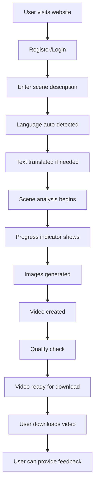

# Video Generation Platform - MVP Features & Roadmap

## Executive Summary

This document defines the Minimum Viable Product (MVP) feature set for the multilingual video generation platform and outlines the comprehensive roadmap for future development. The MVP focuses on core functionality while the roadmap expands into advanced features, enterprise capabilities, and market expansion.

### 🔄 CURRENT STATUS: MVP IN PROGRESS (September 2025 Project Start)
- **MVP Status**: In progress - Only input-processing-service implemented
- **Core Features**: Only input-processing-service implemented and tested
- **Input Processing**: Fully operational with SRP-compliant architecture
- **Language Support**: Telugu, Hindi, and English planned for implementation
- **Database Layer**: Planned schema with proper Unicode support
- **API Layer**: Only input-processing endpoints implemented
- **Docker Infrastructure**: Partial containerization in development
- **Next Phase**: Complete remaining MVP services

## 1. MVP Feature Set (Phase 1 - 3 Months) 🔄 IN PROGRESS

### 1.1 Core MVP Features 🔄 IN PROGRESS

**🔄 STATUS UPDATE** (September 2025): MVP core features in progress. Only input-processing-service implemented with SRP-compliant architecture. Remaining services planned for implementation.

#### 1.1.1 Essential User Features
```json
{
  "user_authentication": {
    "priority": "critical",
    "features": [
      "Email/password registration and login",
      "JWT-based authentication",
      "Password reset functionality",
      "Basic user profile management",
      "Session management"
    ],
    "acceptance_criteria": [
      "Users can register with email and password",
      "Users can login and maintain session",
      "Users can reset forgotten passwords",
      "Users can view and edit basic profile information",
      "Sessions expire after 24 hours of inactivity"
    ]
  },
  
  "multilingual_input": {
    "priority": "critical",
    "features": [
      "Text input in English, Hindi, Telugu",
      "Automatic language detection",
      "Translation to English for processing",
      "Basic text preprocessing and validation",
      "Input length validation (10-2000 characters)"
    ],
    "acceptance_criteria": [
      "Users can input text in supported languages",
      "System automatically detects input language",
      "Non-English text is translated to English",
      "Input is validated for length and content",
      "Translation quality is acceptable for processing"
    ]
  },
  
  "scene_understanding": {
    "priority": "critical",
    "features": [
      "Basic entity extraction (characters, objects, locations)",
      "Simple mood analysis (fearful, romantic, action, peaceful)",
      "Basic camera cues detection",
      "Temporal sequence analysis",
      "Prompt structuring with predefined templates"
    ],
    "acceptance_criteria": [
      "System extracts main characters from input",
      "System identifies key objects and locations",
      "System determines basic mood/atmosphere",
      "System creates structured prompt from input",
      "Prompt contains all required fields for generation"
    ]
  },
  
  "video_generation": {
    "priority": "critical",
    "features": [
      "Image generation using Nano Banana API",
      "Video generation using Veo4 API",
      "Basic post-processing (resolution, format)",
      "Quality validation and error handling",
      "Generation progress tracking"
    ],
    "acceptance_criteria": [
      "System generates 2-4 images per request",
      "System creates video from generated images",
      "Output is in standard format (MP4, 1080p)",
      "Generation completes within 5 minutes",
      "Users receive progress updates during generation"
    ]
  },
  
  "user_interface": {
    "priority": "critical",
    "features": [
      "Responsive web interface",
      "Text input form with language detection",
      "Generation progress indicator",
      "Video playback and download",
      "Basic generation history"
    ],
    "acceptance_criteria": [
      "Interface works on desktop and mobile",
      "Users can easily input scene descriptions",
      "Progress is clearly shown during generation",
      "Users can view and download generated videos",
      "Users can see their generation history"
    ]
  }
}
```

#### 1.1.2 Technical MVP Features
```json
{
  "backend_api": {
    "priority": "critical",
    "features": [
      "RESTful API with FastAPI",
      "Basic authentication and authorization",
      "Input validation and error handling",
      "Generation queue management",
      "File storage and delivery"
    ],
    "acceptance_criteria": [
      "API responds to all requests within 200ms",
      "Authentication is secure and reliable",
      "Input validation prevents invalid requests",
      "Generation queue handles concurrent requests",
      "Files are stored securely and delivered efficiently"
    ]
  },
  
  "database": {
    "priority": "critical",
    "features": [
      "PostgreSQL database with user management",
      "Basic data models (users, generations, feedback)",
      "Database migrations and versioning",
      "Basic backup and recovery",
      "Connection pooling"
    ],
    "acceptance_criteria": [
      "Database stores all user and generation data",
      "Data models support core functionality",
      "Migrations can be applied safely",
      "Backups are created daily",
      "Connection pooling prevents resource exhaustion"
    ]
  },
  
  "caching": {
    "priority": "high",
    "features": [
      "Redis cache for session management",
      "Translation result caching",
      "Generation result caching",
      "Basic cache invalidation",
      "Cache monitoring"
    ],
    "acceptance_criteria": [
      "Sessions are cached for performance",
      "Similar translations are cached",
      "Generation results are cached",
      "Cache is invalidated when appropriate",
      "Cache performance is monitored"
    ]
  }
}
```

### 1.2 MVP User Experience Flow

#### 1.2.1 Complete User Journey


#### 1.2.2 MVP User Interface Mockup
```typescript
// MVP Interface Components
interface MVPInterface {
  // Landing Page
  landingPage: {
    heroSection: "Simple value proposition",
    featureHighlights: "3 key features",
    callToAction: "Get Started button"
  }
  
  // Generation Interface
  generationInterface: {
    textInput: "Large textarea with placeholder",
    languageIndicator: "Shows detected language",
    generateButton: "Start generation button",
    progressBar: "Shows generation progress",
    resultDisplay: "Video player with download"
  }
  
  // User Dashboard
  userDashboard: {
    generationHistory: "List of past generations",
    userProfile: "Basic profile information",
    accountSettings: "Password change, email update"
  }
}
```

### 1.3 MVP Success Metrics

#### 1.3.1 Key Performance Indicators
```json
{
  "user_metrics": {
    "user_registration_rate": "> 100 users in first month",
    "user_retention_rate": "> 40% after 7 days",
    "generation_completion_rate": "> 85%",
    "user_satisfaction_score": "> 4.0/5.0"
  },
  
  "technical_metrics": {
    "api_response_time": "< 200ms average",
    "generation_success_rate": "> 90%",
    "system_uptime": "> 99%",
    "error_rate": "< 2%"
  },
  
  "business_metrics": {
    "generations_per_user": "> 3 per month",
    "user_acquisition_cost": "< $50",
    "time_to_first_generation": "< 5 minutes",
    "support_ticket_rate": "< 5% of users"
  }
}
```

## 2. Phase 2 Features (Months 4-6)

### 2.1 Enhanced User Experience

#### 2.1.1 Advanced User Features
```json
{
  "advanced_customization": {
    "priority": "high",
    "features": [
      "Prompt editing and customization",
      "Style preference selection",
      "Quality tier selection",
      "Custom duration settings",
      "Aspect ratio options"
    ],
    "acceptance_criteria": [
      "Users can edit generated prompts",
      "Users can select from predefined styles",
      "Users can choose quality levels",
      "Users can set video duration",
      "Users can select aspect ratios"
    ]
  },
  
  "batch_processing": {
    "priority": "high",
    "features": [
      "Multiple scene processing",
      "Batch upload functionality",
      "Progress tracking for batches",
      "Batch result management",
      "Export batch results"
    ],
    "acceptance_criteria": [
      "Users can process multiple scenes",
      "Users can upload multiple inputs",
      "Batch progress is tracked",
      "Users can manage batch results",
      "Users can export batch results"
    ]
  },
  
  "social_features": {
    "priority": "medium",
    "features": [
      "Video sharing functionality",
      "Public gallery of generated videos",
      "User profiles and portfolios",
      "Like and comment system",
      "Social media integration"
    ],
    "acceptance_criteria": [
      "Users can share videos publicly",
      "Public gallery displays user videos",
      "Users have public profiles",
      "Users can like and comment",
      "Videos can be shared on social media"
    ]
  },
  
  "voice_input": {
    "priority": "high",
    "features": [
      "Voice-to-text conversion",
      "Real-time voice recording",
      "Audio file upload support",
      "Voice language detection",
      "Voice input validation and processing"
    ],
    "acceptance_criteria": [
      "Users can record voice input directly",
      "Voice is accurately converted to text",
      "Users can upload audio files",
      "System detects language from voice",
      "Voice input integrates with text processing pipeline"
    ]
  }
}
```

#### 2.1.2 Advanced Technical Features
```json
{
  "real_time_updates": {
    "priority": "high",
    "features": [
      "WebSocket integration",
      "Real-time progress updates",
      "Live generation status",
      "Push notifications",
      "Email notifications"
    ],
    "acceptance_criteria": [
      "Users receive real-time updates",
      "Progress is updated live",
      "Generation status is current",
      "Users get push notifications",
      "Users receive email updates"
    ]
  },
  
  "advanced_analytics": {
    "priority": "medium",
    "features": [
      "User behavior tracking",
      "Generation analytics",
      "Performance metrics",
      "Usage patterns analysis",
      "Custom dashboards"
    ],
    "acceptance_criteria": [
      "User behavior is tracked",
      "Generation analytics are available",
      "Performance metrics are collected",
      "Usage patterns are analyzed",
      "Custom dashboards are available"
    ]
  },
  
  "voice_processing_infrastructure": {
    "priority": "high",
    "features": [
      "Audio processing pipeline",
      "Voice recognition service",
      "Audio storage and management",
      "Voice quality validation",
      "Real-time voice processing"
    ],
    "acceptance_criteria": [
      "Audio processing pipeline is operational",
      "Voice recognition service is accurate",
      "Audio files are stored securely",
      "Voice quality is validated",
      "Real-time processing works smoothly"
    ]
  }
}
```

### 2.2 Enhanced AI Capabilities

#### 2.2.1 Advanced Scene Understanding
```json
{
  "advanced_entity_extraction": {
    "priority": "high",
    "features": [
      "Improved character recognition",
      "Complex object detection",
      "Advanced location understanding",
      "Emotional state analysis",
      "Cultural context preservation"
    ],
    "acceptance_criteria": [
      "Character recognition is more accurate",
      "Complex objects are detected",
      "Location understanding is improved",
      "Emotional states are analyzed",
      "Cultural context is preserved"
    ]
  },
  
  "style_optimization": {
    "priority": "high",
    "features": [
      "Genre-specific prompting",
      "Style consistency across generations",
      "Advanced mood analysis",
      "Lighting optimization",
      "Color palette suggestions"
    ],
    "acceptance_criteria": [
      "Prompts are optimized for genres",
      "Style is consistent across generations",
      "Mood analysis is more accurate",
      "Lighting is optimized",
      "Color palettes are suggested"
    ]
  }
}
```

## 3. Phase 3 Features (Months 7-12)

### 3.1 Enterprise Features

#### 3.1.1 Enterprise Capabilities
```json
{
  "enterprise_management": {
    "priority": "high",
    "features": [
      "Multi-user organization management",
      "Role-based access control",
      "Team collaboration features",
      "Enterprise billing and invoicing",
      "Custom branding options"
    ],
    "acceptance_criteria": [
      "Organizations can manage multiple users",
      "Access control is role-based",
      "Teams can collaborate on projects",
      "Enterprise billing is automated",
      "Custom branding is available"
    ]
  },
  
  "api_access": {
    "priority": "high",
    "features": [
      "RESTful API for third-party integration",
      "API key management",
      "Rate limiting and quotas",
      "API documentation and SDKs",
      "Webhook support"
    ],
    "acceptance_criteria": [
      "Third-party developers can integrate",
      "API keys are managed securely",
      "Rate limiting is enforced",
      "API documentation is comprehensive",
      "Webhooks are supported"
    ]
  },
  
  "advanced_security": {
    "priority": "high",
    "features": [
      "Single Sign-On (SSO) integration",
      "Multi-factor authentication",
      "Advanced audit logging",
      "Data encryption at rest",
      "Compliance certifications"
    ],
    "acceptance_criteria": [
      "SSO integration is available",
      "MFA is supported",
      "Audit logs are comprehensive",
      "Data is encrypted at rest",
      "Compliance certifications are obtained"
    ]
  }
}
```

#### 3.1.2 Advanced AI Features
```json
{
  "custom_model_training": {
    "priority": "medium",
    "features": [
      "Custom model fine-tuning",
      "Domain-specific training",
      "User-specific model adaptation",
      "Model performance optimization",
      "A/B testing for models"
    ],
    "acceptance_criteria": [
      "Custom models can be fine-tuned",
      "Domain-specific training is available",
      "User-specific adaptation is possible",
      "Model performance is optimized",
      "A/B testing is supported"
    ]
  },
  
  "advanced_generation": {
    "priority": "medium",
    "features": [
      "4K video generation",
      "Advanced post-processing effects",
      "Audio generation and synchronization",
      "Interactive video elements",
      "VR/AR content generation"
    ],
    "acceptance_criteria": [
      "4K videos can be generated",
      "Advanced effects are available",
      "Audio is generated and synced",
      "Interactive elements are supported",
      "VR/AR content can be generated"
    ]
  }
}
```

### 3.2 Market Expansion Features

#### 3.2.1 Internationalization
```json
{
  "language_expansion": {
    "priority": "medium",
    "features": [
      "Support for 20+ languages",
      "Regional language variants",
      "Cultural adaptation per region",
      "Localized user interface",
      "Regional content libraries"
    ],
    "acceptance_criteria": [
      "20+ languages are supported",
      "Regional variants are available",
      "Cultural adaptation is region-specific",
      "UI is localized",
      "Regional content is available"
    ]
  },
  
  "mobile_app": {
    "priority": "medium",
    "features": [
      "Native iOS and Android apps",
      "Offline functionality",
      "Camera integration",
      "Push notifications",
      "Mobile-optimized interface"
    ],
    "acceptance_criteria": [
      "Native apps are available",
      "Offline functionality works",
      "Camera integration is available",
      "Push notifications are sent",
      "Interface is mobile-optimized"
    ]
  }
}
```

## 4. Future Roadmap (Year 2+)

### 4.1 Advanced Platform Features

#### 4.1.1 AI Innovation
```json
{
  "next_generation_ai": {
    "priority": "medium",
    "features": [
      "GPT-5 integration",
      "Advanced multimodal AI",
      "Real-time generation",
      "AI-powered editing tools",
      "Predictive content generation"
    ],
    "timeline": "Year 2",
    "investment": "High"
  },
  
  "creative_tools": {
    "priority": "medium",
    "features": [
      "AI-powered storyboarding",
      "Character consistency across scenes",
      "Advanced animation tools",
      "Music and sound generation",
      "Collaborative editing platform"
    ],
    "timeline": "Year 2",
    "investment": "Medium"
  }
}
```

#### 4.1.2 Platform Ecosystem
```json
{
  "marketplace": {
    "priority": "low",
    "features": [
      "User-generated content marketplace",
      "Template and style marketplace",
      "Third-party plugin ecosystem",
      "Creator monetization tools",
      "Community-driven features"
    ],
    "timeline": "Year 3",
    "investment": "High"
  },
  
  "enterprise_solutions": {
    "priority": "medium",
    "features": [
      "White-label solutions",
      "Custom deployment options",
      "Enterprise integrations",
      "Advanced analytics and reporting",
      "Dedicated support and training"
    ],
    "timeline": "Year 2",
    "investment": "Medium"
  }
}
```

### 4.2 Market Expansion

#### 4.2.1 Global Reach
```json
{
  "global_expansion": {
    "priority": "low",
    "features": [
      "Support for 50+ languages",
      "Regional data centers",
      "Local partnerships",
      "Regional pricing strategies",
      "Cultural content adaptation"
    ],
    "timeline": "Year 3",
    "investment": "High"
  },
  
  "vertical_expansion": {
    "priority": "low",
    "features": [
      "Education sector solutions",
      "Marketing and advertising tools",
      "Entertainment industry features",
      "Corporate training solutions",
      "Healthcare communication tools"
    ],
    "timeline": "Year 3",
    "investment": "Medium"
  }
}
```

## 5. Feature Prioritization Matrix

### 5.1 Priority Framework

#### 5.1.1 Priority Criteria
```json
{
  "criteria": {
    "user_impact": "How much does this feature improve user experience?",
    "business_value": "How much does this feature contribute to business goals?",
    "technical_complexity": "How complex is this feature to implement?",
    "market_demand": "How much do users want this feature?",
    "competitive_advantage": "How much does this feature differentiate us?"
  },
  
  "scoring": {
    "high": 3,
    "medium": 2,
    "low": 1
  }
}
```

#### 5.1.2 Feature Scoring Matrix
```json
{
  "mvp_features": {
    "user_authentication": {
      "user_impact": 3,
      "business_value": 3,
      "technical_complexity": 2,
      "market_demand": 3,
      "competitive_advantage": 1,
      "total_score": 12,
      "priority": "critical"
    },
    "multilingual_input": {
      "user_impact": 3,
      "business_value": 3,
      "technical_complexity": 3,
      "market_demand": 3,
      "competitive_advantage": 3,
      "total_score": 15,
      "priority": "critical"
    },
    "video_generation": {
      "user_impact": 3,
      "business_value": 3,
      "technical_complexity": 3,
      "market_demand": 3,
      "competitive_advantage": 2,
      "total_score": 14,
      "priority": "critical"
    }
  },
  
  "phase_2_features": {
    "advanced_customization": {
      "user_impact": 3,
      "business_value": 2,
      "technical_complexity": 2,
      "market_demand": 2,
      "competitive_advantage": 2,
      "total_score": 11,
      "priority": "high"
    },
    "voice_input": {
      "user_impact": 3,
      "business_value": 3,
      "technical_complexity": 3,
      "market_demand": 3,
      "competitive_advantage": 3,
      "total_score": 15,
      "priority": "high"
    },
    "social_features": {
      "user_impact": 2,
      "business_value": 2,
      "technical_complexity": 2,
      "market_demand": 2,
      "competitive_advantage": 1,
      "total_score": 9,
      "priority": "medium"
    }
  }
}
```

## 6. Development Timeline

### 6.1 MVP Development Schedule

#### 6.1.1 3-Month MVP Timeline
```json
{
  "month_1": {
    "weeks_1_2": [
      "Project setup and architecture",
      "Database design and setup",
      "Basic authentication system",
      "Frontend foundation"
    ],
    "weeks_3_4": [
      "Language detection and translation",
      "Basic scene understanding",
      "API development",
      "Frontend integration"
    ]
  },
  
  "month_2": {
    "weeks_5_6": [
      "AI generation integration",
      "Video processing pipeline",
      "User interface completion",
      "Basic testing"
    ],
    "weeks_7_8": [
      "Quality assurance and testing",
      "Performance optimization",
      "Error handling",
      "Documentation"
    ]
  },
  
  "month_3": {
    "weeks_9_10": [
      "Beta testing with limited users",
      "Bug fixes and improvements",
      "Performance tuning",
      "Security audit"
    ],
    "weeks_11_12": [
      "Final testing and validation",
      "Production deployment",
      "User onboarding",
      "Launch preparation"
    ]
  }
}
```

### 6.2 Resource Requirements

#### 6.2.1 Team Structure
```json
{
  "mvp_team": {
    "backend_developers": 2,
    "frontend_developers": 2,
    "ai_ml_engineers": 1,
    "devops_engineer": 1,
    "product_manager": 1,
    "ui_ux_designer": 1,
    "qa_engineer": 1,
    "total_team_size": 9
  },
  
  "phase_2_team": {
    "backend_developers": 3,
    "frontend_developers": 3,
    "ai_ml_engineers": 2,
    "devops_engineers": 2,
    "product_managers": 2,
    "ui_ux_designers": 2,
    "qa_engineers": 2,
    "marketing_manager": 1,
    "total_team_size": 17
  }
}
```

## 7. Success Metrics & KPIs

### 7.1 MVP Success Criteria

#### 7.1.1 Launch Criteria
```json
{
  "technical_criteria": {
    "system_uptime": "> 99%",
    "api_response_time": "< 200ms",
    "generation_success_rate": "> 90%",
    "error_rate": "< 2%",
    "security_vulnerabilities": "0 critical"
  },
  
  "user_criteria": {
    "user_registration": "> 100 users",
    "generation_completion": "> 85%",
    "user_satisfaction": "> 4.0/5.0",
    "support_tickets": "< 5% of users",
    "user_retention": "> 40% after 7 days"
  },
  
  "business_criteria": {
    "time_to_market": "< 3 months",
    "development_cost": "< $500K",
    "user_acquisition_cost": "< $50",
    "generations_per_user": "> 3 per month",
    "revenue_potential": "> $10K MRR by month 6"
  }
}
```

### 7.2 Growth Metrics

#### 7.2.1 Phase 2 Success Criteria
```json
{
  "user_growth": {
    "monthly_active_users": "> 10K",
    "user_retention_rate": "> 60% after 30 days",
    "generations_per_user": "> 10 per month",
    "user_satisfaction": "> 4.5/5.0"
  },
  
  "business_growth": {
    "monthly_recurring_revenue": "> $100K",
    "customer_acquisition_cost": "< $30",
    "lifetime_value": "> $500",
    "churn_rate": "< 5% monthly"
  },
  
  "product_growth": {
    "feature_adoption_rate": "> 70%",
    "user_engagement": "> 80% weekly",
    "generation_quality_score": "> 4.0/5.0",
    "support_resolution_time": "< 24 hours"
  }
}
```

## 8. Risk Mitigation

### 8.1 MVP Risks

#### 8.1.1 Technical Risks
```json
{
  "ai_generation_quality": {
    "risk": "Generated videos may not meet quality expectations",
    "mitigation": "Extensive testing and quality validation",
    "fallback": "Manual quality review process"
  },
  
  "scalability_concerns": {
    "risk": "System may not handle concurrent users",
    "mitigation": "Load testing and performance optimization",
    "fallback": "Queue management and rate limiting"
  },
  
  "api_dependencies": {
    "risk": "Third-party APIs may be unreliable",
    "mitigation": "Multiple provider fallbacks",
    "fallback": "Graceful degradation and error handling"
  }
}
```

#### 8.1.2 Business Risks
```json
{
  "user_adoption": {
    "risk": "Users may not adopt the platform",
    "mitigation": "User research and iterative development",
    "fallback": "Pivot to different target market"
  },
  
  "competition": {
    "risk": "Competitors may launch similar products",
    "mitigation": "Focus on unique value proposition",
    "fallback": "Accelerate development timeline"
  },
  
  "cost_management": {
    "risk": "AI generation costs may exceed budget",
    "mitigation": "Cost optimization and usage monitoring",
    "fallback": "Implement usage limits and pricing tiers"
  }
}
```

This comprehensive MVP features and roadmap document provides a clear path from initial launch to full platform maturity. The MVP focuses on core functionality while the roadmap expands into advanced features, enterprise capabilities, and market expansion.

Would you like me to proceed with the next task in our todo list, or would you like me to elaborate on any specific aspect of this MVP features and roadmap?
