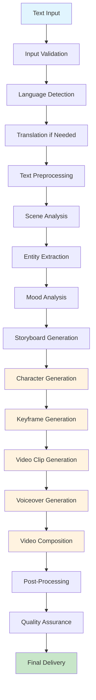

# GenAI Pipeline Workflow

## 🔄 Complete Video Generation Pipeline

The CinBoard AI platform implements a sophisticated GenAI pipeline that automates the entire video creation process from text input to final video delivery. This workflow ensures consistent character appearance, professional quality, and multilingual support.

## 📋 Pipeline Overview



## 🎯 Detailed Pipeline Stages

### Stage 1: Text Input Processing ✅ **IMPLEMENTED**

**Service**: Input Processing Service  
**Duration**: 2-5 seconds  
**Status**: Fully operational

#### Process Flow
```python
async def process_text_input(text: str, user_id: int) -> ProcessingResult:
    # Step 1: Input Validation
    validation_result = await validate_input(text, user_id)
    if not validation_result.is_valid:
        return ProcessingResult(status="FAILED", error=validation_result.errors)
    
    # Step 2: Language Detection
    language_result = await detect_language(text)
    
    # Step 3: Translation (if needed)
    if language_result.language != "en":
        translation_result = await translate_text(text, language_result.language, "en")
        processed_text = translation_result.translated_text
    else:
        processed_text = text
    
    # Step 4: Text Preprocessing
    preprocessed_text = await preprocess_text(processed_text)
    
    return ProcessingResult(
        status="SUCCESS",
        processed_text=preprocessed_text,
        language_info=language_result,
        translation_info=translation_result if translation_result else None
    )
```

#### Input/Output
- **Input**: Raw text in any supported language
- **Output**: Cleaned, validated, translated text ready for analysis
- **Supported Languages**: Telugu, Hindi, English, Tamil, Bengali, Gujarati, Marathi, Kannada, Malayalam, Odia, Punjabi

### Stage 2: Scene Analysis 🔄 **PLANNED**

**Service**: Scene Analysis Service  
**Duration**: 5-10 seconds  
**Status**: Planned but not implemented

#### Process Flow
```python
async def analyze_scenes(processed_text: str) -> SceneAnalysisResult:
    # Step 1: Entity Extraction
    entities = await extract_entities(processed_text)
    # Extract: characters, objects, locations, actions
    
    # Step 2: Mood Analysis
    mood_analysis = await analyze_mood(processed_text)
    # Determine: emotional tone, atmosphere, visual style
    
    # Step 3: Camera Analysis
    camera_cues = await extract_camera_cues(processed_text)
    # Extract: shot types, movements, transitions
    
    # Step 4: Temporal Analysis
    temporal_analysis = await analyze_temporal_sequence(processed_text)
    # Determine: scene breaks, timing, sequence
    
    return SceneAnalysisResult(
        entities=entities,
        mood_analysis=mood_analysis,
        camera_cues=camera_cues,
        temporal_analysis=temporal_analysis
    )
```

#### Input/Output
- **Input**: Preprocessed text
- **Output**: Structured scene analysis with entities, mood, camera cues, and timing

### Stage 3: Storyboard Generation 🔄 **PLANNED**

**Service**: Scene Analysis Service (Extended)  
**Duration**: 3-5 seconds  
**Status**: Planned but not implemented

#### Process Flow
```python
async def generate_storyboard(scene_analysis: SceneAnalysisResult) -> StoryboardResult:
    # Step 1: Scene Breakdown
    scenes = await break_down_scenes(scene_analysis.temporal_analysis)
    
    # Step 2: Character Descriptions
    character_descriptions = await generate_character_descriptions(scene_analysis.entities)
    
    # Step 3: Keyframe Descriptions
    keyframe_descriptions = await generate_keyframe_descriptions(scenes, scene_analysis.camera_cues)
    
    # Step 4: Visual Style Guidelines
    visual_style = await determine_visual_style(scene_analysis.mood_analysis)
    
    return StoryboardResult(
        scenes=scenes,
        character_descriptions=character_descriptions,
        keyframe_descriptions=keyframe_descriptions,
        visual_style=visual_style
    )
```

#### Input/Output
- **Input**: Scene analysis results
- **Output**: Structured storyboard with scenes, characters, and keyframes

### Stage 4: Character Generation ⚠️ **NEW REQUIREMENT**

**Service**: Character Generation Service  
**Duration**: 10-15 seconds  
**Status**: New requirement from GenAI workflow

#### Process Flow
```python
async def generate_characters(storyboard: StoryboardResult) -> CharacterGenerationResult:
    characters = []
    
    for character_desc in storyboard.character_descriptions:
        # Step 1: Generate Character Image
        character_image = await whisk_client.generate_character({
            "description": character_desc.description,
            "style": storyboard.visual_style,
            "consistency_key": character_desc.consistency_key
        })
        
        # Step 2: Validate Character Quality
        quality_check = await validate_character_quality(character_image)
        
        # Step 3: Cache Character for Consistency
        await cache_character(character_desc.id, character_image)
        
        characters.append(CharacterImage(
            id=character_desc.id,
            name=character_desc.name,
            image_url=character_image.url,
            quality_score=quality_check.score
        ))
    
    return CharacterGenerationResult(characters=characters)
```

#### Input/Output
- **Input**: Character descriptions from storyboard
- **Output**: Consistent character images with quality validation
- **External Service**: Whisk AI for character generation

### Stage 5: Keyframe Generation ⚠️ **NEW REQUIREMENT**

**Service**: Keyframe Generation Service  
**Duration**: 15-20 seconds  
**Status**: New requirement from GenAI workflow

#### Process Flow
```python
async def generate_keyframes(storyboard: StoryboardResult, characters: List[CharacterImage]) -> KeyframeGenerationResult:
    keyframes = []
    
    for scene in storyboard.scenes:
        # Determine keyframe count (1-3 per 8-second clip)
        keyframe_count = min(3, max(1, scene.duration_seconds // 4))
        
        for i in range(keyframe_count):
            # Step 1: Generate Keyframe Description
            keyframe_desc = await generate_keyframe_description(scene, i, keyframe_count)
            
            # Step 2: Generate Keyframe Image
            keyframe_image = await image_generator.generate_keyframe({
                "description": keyframe_desc,
                "characters": [char for char in characters if char.scene_id == scene.id],
                "style": storyboard.visual_style,
                "camera_cue": scene.camera_cues[i] if i < len(scene.camera_cues) else None
            })
            
            # Step 3: Validate Keyframe Quality
            quality_check = await validate_keyframe_quality(keyframe_image)
            
            keyframes.append(KeyframeImage(
                scene_id=scene.id,
                sequence=i,
                image_url=keyframe_image.url,
                timing_seconds=scene.start_time + (i * scene.duration_seconds / keyframe_count),
                quality_score=quality_check.score
            ))
    
    return KeyframeGenerationResult(keyframes=keyframes)
```

#### Input/Output
- **Input**: Storyboard scenes and generated characters
- **Output**: 1-3 keyframes per 8-second video clip with timing information

### Stage 6: Video Clip Generation 🔄 **PLANNED**

**Service**: Video Generation Service  
**Duration**: 30-45 seconds  
**Status**: Planned but not implemented

#### Process Flow
```python
async def generate_video_clips(keyframes: List[KeyframeImage], characters: List[CharacterImage]) -> VideoGenerationResult:
    video_clips = []
    
    # Group keyframes by scene
    scenes = group_keyframes_by_scene(keyframes)
    
    for scene_keyframes in scenes:
        # Step 1: Prepare Veo4 Input
        veo4_input = await prepare_veo4_input(scene_keyframes, characters)
        
        # Step 2: Generate Video Clip
        video_clip = await veo4_client.generate_video({
            "keyframes": veo4_input.keyframes,
            "characters": veo4_input.characters,
            "duration": scene_keyframes[0].scene_duration,
            "style": veo4_input.visual_style,
            "transitions": veo4_input.transitions
        })
        
        # Step 3: Validate Video Quality
        quality_check = await validate_video_quality(video_clip)
        
        # Step 4: Process Video Clip
        processed_clip = await process_video_clip(video_clip)
        
        video_clips.append(VideoClip(
            scene_id=scene_keyframes[0].scene_id,
            video_url=processed_clip.url,
            duration_seconds=processed_clip.duration,
            quality_score=quality_check.score
        ))
    
    return VideoGenerationResult(video_clips=video_clips)
```

#### Input/Output
- **Input**: Keyframes and characters for each scene
- **Output**: 8-second video clips for each scene
- **External Service**: Veo4 API for video generation

### Stage 7: Voiceover Generation ⚠️ **NEW REQUIREMENT**

**Service**: Voiceover Generation Service  
**Duration**: 10-15 seconds  
**Status**: New requirement from GenAI workflow

#### Process Flow
```python
async def generate_voiceover(processed_text: str, language_info: LanguageInfo) -> VoiceoverGenerationResult:
    # Step 1: Analyze Text for Voice Selection
    voice_analysis = await analyze_text_for_voice(processed_text)
    
    # Step 2: Select Appropriate Voice
    voice_settings = await select_voice_settings(language_info.language, voice_analysis)
    
    # Step 3: Generate Voiceover
    voiceover = await eleven_labs_client.generate_speech({
        "text": processed_text,
        "voice_id": voice_settings.voice_id,
        "language": language_info.language,
        "speed": voice_settings.speed,
        "pitch": voice_settings.pitch,
        "emotion": voice_analysis.emotion
    })
    
    # Step 4: Validate Audio Quality
    quality_check = await validate_audio_quality(voiceover)
    
    # Step 5: Process Audio
    processed_audio = await process_audio(voiceover)
    
    return VoiceoverGenerationResult(
        audio_url=processed_audio.url,
        duration_seconds=processed_audio.duration,
        voice_settings=voice_settings,
        quality_score=quality_check.score
    )
```

#### Input/Output
- **Input**: Processed text and language information
- **Output**: High-quality voiceover audio with appropriate voice selection
- **External Service**: Eleven Labs API for voice synthesis

### Stage 8: Video Composition ⚠️ **NEW REQUIREMENT**

**Service**: Video Composition Service  
**Duration**: 20-30 seconds  
**Status**: New requirement from GenAI workflow

#### Process Flow
```python
async def compose_final_video(video_clips: List[VideoClip], voiceover: AudioFile) -> VideoCompositionResult:
    # Step 1: Stitch Video Clips
    stitched_video = await stitch_video_clips(video_clips)
    
    # Step 2: Synchronize Audio
    synchronized_video = await synchronize_audio(stitched_video, voiceover)
    
    # Step 3: Add Transitions
    final_video = await add_transitions(synchronized_video, video_clips)
    
    # Step 4: Final Quality Check
    quality_check = await validate_final_video_quality(final_video)
    
    # Step 5: Optimize for Delivery
    optimized_video = await optimize_for_delivery(final_video)
    
    return VideoCompositionResult(
        video_url=optimized_video.url,
        duration_seconds=optimized_video.duration,
        quality_score=quality_check.score,
        file_size=optimized_video.file_size
    )
```

#### Input/Output
- **Input**: Video clips and voiceover audio
- **Output**: Complete storytelling video with synchronized audio

### Stage 9: Post-Processing 🔄 **PLANNED**

**Service**: Post-Processing Service  
**Duration**: 10-15 seconds  
**Status**: Planned but not implemented

#### Process Flow
```python
async def post_process_video(composed_video: VideoCompositionResult) -> PostProcessingResult:
    # Step 1: Quality Enhancement
    enhanced_video = await enhance_video_quality(composed_video)
    
    # Step 2: Format Optimization
    optimized_video = await optimize_video_format(enhanced_video)
    
    # Step 3: CDN Upload
    cdn_url = await upload_to_cdn(optimized_video)
    
    # Step 4: Generate Thumbnails
    thumbnails = await generate_thumbnails(optimized_video)
    
    # Step 5: Final Validation
    final_validation = await validate_final_output(optimized_video)
    
    return PostProcessingResult(
        final_video_url=cdn_url,
        thumbnails=thumbnails,
        quality_score=final_validation.score,
        delivery_ready=True
    )
```

#### Input/Output
- **Input**: Composed video from previous stage
- **Output**: Enhanced, optimized video ready for delivery

### Stage 10: Quality Assurance & Delivery ✅ **IMPLEMENTED**

**Service**: Post-Processing Service (Extended)  
**Duration**: 5-10 seconds  
**Status**: Partially implemented

#### Process Flow
```python
async def quality_assurance_and_delivery(post_processed_video: PostProcessingResult) -> DeliveryResult:
    # Step 1: Final Quality Check
    quality_metrics = await perform_final_quality_check(post_processed_video)
    
    # Step 2: Generate Delivery URLs
    delivery_urls = await generate_delivery_urls(post_processed_video)
    
    # Step 3: Update Processing Status
    await update_processing_status("COMPLETED", 100)
    
    # Step 4: Send Notification
    await send_completion_notification(delivery_urls)
    
    return DeliveryResult(
        video_url=delivery_urls.video_url,
        thumbnail_urls=delivery_urls.thumbnail_urls,
        quality_metrics=quality_metrics,
        delivery_ready=True
    )
```

#### Input/Output
- **Input**: Post-processed video
- **Output**: Final delivery URLs and quality metrics

## 🔄 Pipeline Orchestration

### Workflow Coordination
```python
class VideoGenerationOrchestrator:
    """Coordinates the complete video generation workflow"""
    
    async def generate_video(self, text_input: str, user_id: int) -> GenerationResult:
        generation_id = str(uuid.uuid4())
        
        try:
            # Stage 1: Text Processing
            text_result = await self.input_service.process_text_input(text_input, user_id)
            
            # Stage 2: Scene Analysis
            scene_result = await self.scene_service.analyze_scenes(text_result.processed_text)
            
            # Stage 3: Storyboard Generation
            storyboard_result = await self.scene_service.generate_storyboard(scene_result)
            
            # Stage 4: Character Generation
            character_result = await self.character_service.generate_characters(storyboard_result)
            
            # Stage 5: Keyframe Generation
            keyframe_result = await self.keyframe_service.generate_keyframes(storyboard_result, character_result.characters)
            
            # Stage 6: Video Generation
            video_result = await self.video_service.generate_video_clips(keyframe_result.keyframes, character_result.characters)
            
            # Stage 7: Voiceover Generation
            voiceover_result = await self.voiceover_service.generate_voiceover(text_result.processed_text, text_result.language_info)
            
            # Stage 8: Video Composition
            composition_result = await self.composition_service.compose_final_video(video_result.video_clips, voiceover_result.audio)
            
            # Stage 9: Post-Processing
            post_result = await self.post_service.post_process_video(composition_result)
            
            # Stage 10: Delivery
            delivery_result = await self.post_service.quality_assurance_and_delivery(post_result)
            
            return GenerationResult(
                status="SUCCESS",
                generation_id=generation_id,
                final_video_url=delivery_result.video_url,
                quality_metrics=delivery_result.quality_metrics
            )
            
        except Exception as e:
            await self.handle_generation_error(generation_id, str(e))
            return GenerationResult(status="FAILED", error=str(e))
```

## ⚡ Performance Optimization

### Caching Strategy
- **Translation Cache**: Cache translation results for repeated text
- **Character Cache**: Cache character images for consistency
- **Keyframe Cache**: Cache keyframe images for reuse
- **Video Cache**: Cache generated video clips
- **Voiceover Cache**: Cache voiceover audio for repeated text

### Parallel Processing
- **Character Generation**: Generate multiple characters in parallel
- **Keyframe Generation**: Generate keyframes for multiple scenes in parallel
- **Video Generation**: Generate video clips for multiple scenes in parallel

### Error Handling
- **Retry Logic**: Automatic retry for transient failures
- **Fallback Services**: Alternative AI services for critical components
- **Graceful Degradation**: Continue processing with reduced quality if needed

## 📊 Quality Metrics

### Technical Metrics
- **Processing Time**: Total pipeline duration
- **Success Rate**: Percentage of successful generations
- **Quality Score**: Automated quality assessment
- **Resource Usage**: CPU, memory, storage utilization

### Content Metrics
- **Character Consistency**: Character appearance consistency across scenes
- **Audio Sync**: Voiceover synchronization accuracy
- **Visual Quality**: Video quality and resolution
- **Cultural Accuracy**: Cultural context preservation

---

This GenAI pipeline provides a comprehensive, automated workflow for converting text descriptions into professional videos while maintaining character consistency, cultural context, and multilingual support.
