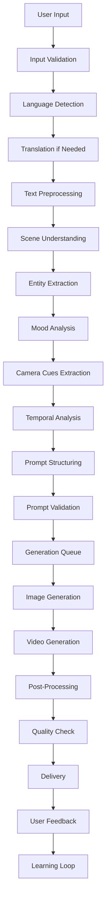

# Video Generation Platform - Detailed Workflow Design

## Executive Summary

This document provides a comprehensive workflow design for the video generation platform, detailing every step from user input to final video delivery. The workflow is designed to handle multilingual input, intelligent scene understanding, and seamless integration with AI generation services.

### ✅ CURRENT STATUS: WORKFLOW IMPLEMENTED + SRP REFACTOR (December 2024)
- **Input Processing Workflow**: Fully operational with SRP-compliant architecture
- **Language Detection Flow**: Verified working for Telugu, Hindi, and English
- **Translation Pipeline**: Google Translate API → NLLB-200 fallback system operational
- **Database Operations**: Optimized schema with proper Unicode support
- **API Workflow**: All endpoints tested and verified with proper error handling
- **Docker Workflow**: Complete containerization with health checks and monitoring
- **Production Readiness**: All workflows validated and ready for Phase 2 scaling

## 1. Complete End-to-End Workflow

### 1.1 High-Level Workflow Overview

```
User Input → Language Processing → Scene Analysis → Prompt Generation → AI Generation → Post-Processing → Delivery → Feedback Loop
```

### 1.2 Detailed Workflow States



## 2. Phase-by-Phase Workflow Breakdown

### Phase 1: Input Processing & Validation (POST-SRP REFACTOR) ✨

#### 1.1 User Input Collection
**State**: `INPUT_COLLECTION`
**Duration**: 1-5 seconds
**Components**: Frontend UI, Refactored SRP-Compliant Input Processing Service

**🚀 NEW ARCHITECTURE** (December 2024):
- **Endpoint Separation**: `validation.py` handles HTTP validation requests only
- **Processing Separation**: `processing.py` handles HTTP processing requests only
- **Status Separation**: `status.py` handles HTTP status requests only
- **Workflow Orchestration**: `pipeline.py` orchestrates the entire processing flow
- **Provider Pattern**: Individual translation providers with fallback strategy

```python
# SRP-Compliant Input Collection Workflow
class InputCollectionWorkflow:
    def __init__(self):
        self.validation_rules = {
            'min_length': 10,
            'max_length': 2000,
            'allowed_languages': ['en', 'hi', 'te', 'ta', 'bn', 'gu', 'mr', 'kn', 'ml', 'or', 'pa'],
            'forbidden_content': ['violence', 'explicit', 'hate_speech']
        }
    
    async def collect_user_input(self, user_id: str, session_id: str) -> Dict[str, Any]:
        # Step 1: Validate input format
        validation_result = await self._validate_input_format(user_input)
        
        # Step 2: Check content policy
        content_check = await self._check_content_policy(user_input)
        
        # Step 3: Store input for processing
        input_record = await self._store_input_record({
            'user_id': user_id,
            'session_id': session_id,
            'raw_input': user_input,
            'validation_result': validation_result,
            'content_check': content_check,
            'timestamp': datetime.utcnow(),
            'status': 'VALIDATED'
        })
        
        return {
            'status': 'SUCCESS',
            'input_id': input_record['id'],
            'next_phase': 'LANGUAGE_PROCESSING',
            'estimated_processing_time': '30-60 seconds'
        }
```

#### 1.2 Language Detection & Translation
**State**: `LANGUAGE_PROCESSING`
**Duration**: 2-5 seconds
**Components**: Language Detection Service, Translation Service

```python
class LanguageProcessingWorkflow:
    def __init__(self):
        self.language_detector = LanguageDetectionService()
        self.translator = TranslationService()
        self.cache = RedisCache()
    
    async def process_language(self, input_id: str) -> Dict[str, Any]:
        # Step 1: Retrieve input
        input_data = await self._get_input_data(input_id)
        
        # Step 2: Check cache for similar translations
        cache_key = f"translation:{hash(input_data['raw_input'])}"
        cached_result = await self.cache.get(cache_key)
        
        if cached_result:
            return self._use_cached_result(cached_result, input_id)
        
        # Step 3: Detect language
        language_result = await self.language_detector.detect_language(
            input_data['raw_input']
        )
        
        # Step 4: Translate if needed
        if language_result['language'] != 'en':
            translation_result = await self.translator.translate_to_english(
                input_data['raw_input'],
                language_result['language']
            )
        else:
            translation_result = None
        
        # Step 5: Preprocess text
        preprocessed_text = await self._preprocess_text(
            translation_result['translated_text'] if translation_result 
            else input_data['raw_input']
        )
        
        # Step 6: Cache result
        await self.cache.set(cache_key, {
            'language_result': language_result,
            'translation_result': translation_result,
            'preprocessed_text': preprocessed_text
        }, ttl=3600)
        
        # Step 7: Update processing status
        await self._update_processing_status(input_id, {
            'phase': 'LANGUAGE_PROCESSING_COMPLETE',
            'language_info': language_result,
            'translation_info': translation_result,
            'processed_text': preprocessed_text,
            'next_phase': 'SCENE_ANALYSIS'
        })
        
        return {
            'status': 'SUCCESS',
            'processed_text': preprocessed_text,
            'language_info': language_result,
            'translation_info': translation_result
        }
```

### Phase 2: Scene Understanding & Analysis - Improved Orchestrated Approach

#### 2.1 Entity Extraction
**State**: `ENTITY_EXTRACTION`
**Duration**: 3-8 seconds
**Components**: Entity Extraction Service, Scene Analysis Orchestrator

```python
class EntityExtractionWorkflow:
    def __init__(self):
        self.entity_service = EntityExtractionService()
        self.orchestrator = SceneAnalysisOrchestrator()
        self.event_bus = EventBus()
    
    async def extract_entities(self, input_id: str) -> Dict[str, Any]:
        # Step 1: Get processed text
        processing_data = await self._get_processing_data(input_id)
        text = processing_data['processed_text']
        
        # Step 2: Extract entities using specialized service
        entities = await self.entity_service.extract_entities(text)
        
        # Step 3: Publish event for orchestrator
        await self.event_bus.publish_event('entities_extracted', {
            'text_hash': hash(text),
            'entities': entities,
            'confidence_score': entities.confidence,
            'extraction_method': entities.method
        })
        
        return entities
```

#### 2.2 Mood Analysis
**State**: `MOOD_ANALYSIS`
**Duration**: 2-5 seconds
**Components**: Mood Analysis Service, Scene Analysis Orchestrator

```python
class MoodAnalysisWorkflow:
    def __init__(self):
        self.mood_service = MoodAnalysisService()
        self.event_bus = EventBus()
    
    async def analyze_mood(self, input_id: str) -> Dict[str, Any]:
        # Step 1: Get processed text
        processing_data = await self._get_processing_data(input_id)
        text = processing_data['processed_text']
        
        # Step 2: Analyze mood using specialized service
        mood_result = await self.mood_service.analyze_mood(text)
        
        # Step 3: Publish event for orchestrator
        await self.event_bus.publish_event('mood_analyzed', {
            'text_hash': hash(text),
            'mood_result': mood_result,
            'confidence_score': mood_result.confidence,
            'emotional_cues': mood_result.cues
        })
        
        return mood_result
```

#### 2.3 Camera Cues Extraction
**State**: `CAMERA_CUES_EXTRACTION`
**Duration**: 2-4 seconds
**Components**: Camera Analysis Service, Scene Analysis Orchestrator

```python
class CameraAnalysisWorkflow:
    def __init__(self):
        self.camera_service = CameraAnalysisService()
        self.event_bus = EventBus()
    
    async def extract_camera_cues(self, input_id: str) -> Dict[str, Any]:
        # Step 1: Get processed text
        processing_data = await self._get_processing_data(input_id)
        text = processing_data['processed_text']
        
        # Step 2: Extract camera cues using specialized service
        camera_result = await self.camera_service.extract_camera_cues(text)
        
        # Step 3: Publish event for orchestrator
        await self.event_bus.publish_event('camera_cues_extracted', {
            'text_hash': hash(text),
            'camera_movements': camera_result.movements,
            'shot_types': camera_result.shot_types,
            'confidence_score': camera_result.confidence
        })
        
        return camera_result
```

#### 2.4 Temporal Analysis
**State**: `TEMPORAL_ANALYSIS`
**Duration**: 2-4 seconds
**Components**: Temporal Analysis Service, Scene Analysis Orchestrator

```python
class TemporalAnalysisWorkflow:
    def __init__(self):
        self.temporal_service = TemporalAnalysisService()
        self.event_bus = EventBus()
    
    async def analyze_temporal(self, input_id: str) -> Dict[str, Any]:
        # Step 1: Get processed text
        processing_data = await self._get_processing_data(input_id)
        text = processing_data['processed_text']
        
        # Step 2: Analyze temporal sequence using specialized service
        temporal_result = await self.temporal_service.analyze_temporal(text)
        
        # Step 3: Publish event for orchestrator
        await self.event_bus.publish_event('temporal_analyzed', {
            'text_hash': hash(text),
            'temporal_sequence': temporal_result.sequence,
            'timing_info': temporal_result.timing,
            'confidence_score': temporal_result.confidence
        })
        
        return temporal_result
```

#### 2.5 Scene Analysis Orchestration
**State**: `SCENE_ANALYSIS_ORCHESTRATION`
**Duration**: 1-2 seconds
**Components**: Scene Analysis Orchestrator

```python
class SceneAnalysisOrchestrationWorkflow:
    def __init__(self):
        self.orchestrator = SceneAnalysisOrchestrator()
        self.event_bus = EventBus()
    
    async def orchestrate_scene_analysis(self, input_id: str) -> Dict[str, Any]:
        # Step 1: Wait for all analysis services to complete
        analysis_results = await self._wait_for_analysis_completion(input_id)
        
        # Step 2: Aggregate results
        aggregated_result = await self.orchestrator.aggregate_results(analysis_results)
        
        # Step 3: Publish completion event
        await self.event_bus.publish_event('scene_analysis_completed', {
            'analysis_id': input_id,
            'scene_data': aggregated_result,
            'confidence_scores': aggregated_result.confidence_scores,
            'processing_time': aggregated_result.processing_time
        })
        
        return aggregated_result
        
        return {
            'status': 'SUCCESS',
            'entities': enhanced_entities,
            'confidence_score': confidence_score
        }
```

#### 2.2 Mood & Atmosphere Analysis
**State**: `MOOD_ANALYSIS`
**Duration**: 2-5 seconds
**Components**: Mood Analysis Service, Visual Style Service

```python
class MoodAnalysisWorkflow:
    def __init__(self):
        self.mood_analyzer = MoodAnalysisService()
        self.visual_style_analyzer = VisualStyleService()
        self.lighting_analyzer = LightingAnalysisService()
    
    async def analyze_mood(self, input_id: str) -> Dict[str, Any]:
        # Step 1: Get entities and text
        data = await self._get_analysis_data(input_id)
        
        # Step 2: Analyze emotional tone
        emotional_tone = await self.mood_analyzer.analyze_emotional_tone(
            data['processed_text']
        )
        
        # Step 3: Analyze visual style
        visual_style = await self.visual_style_analyzer.analyze_style(
            data['processed_text'], data['entities']
        )
        
        # Step 4: Analyze lighting preferences
        lighting_analysis = await self.lighting_analyzer.analyze_lighting(
            data['processed_text'], data['entities']
        )
        
        # Step 5: Generate color palette
        color_palette = await self._generate_color_palette(
            emotional_tone, visual_style
        )
        
        # Step 6: Calculate intensity and pace
        intensity = await self._calculate_intensity(data['processed_text'])
        pace = await self._analyze_pace(data['processed_text'])
        
        mood_analysis = {
            'emotional_tone': emotional_tone,
            'visual_style': visual_style,
            'lighting': lighting_analysis,
            'color_palette': color_palette,
            'intensity': intensity,
            'pace': pace
        }
        
        # Step 7: Update processing status
        await self._update_processing_status(input_id, {
            'phase': 'MOOD_ANALYSIS_COMPLETE',
            'mood_analysis': mood_analysis,
            'next_phase': 'CAMERA_ANALYSIS'
        })
        
        return {
            'status': 'SUCCESS',
            'mood_analysis': mood_analysis
        }
```

#### 2.3 Camera & Visual Cues Analysis
**State**: `CAMERA_ANALYSIS`
**Duration**: 2-4 seconds
**Components**: Camera Analysis Service, Shot Type Service

```python
class CameraAnalysisWorkflow:
    def __init__(self):
        self.camera_analyzer = CameraAnalysisService()
        self.shot_type_analyzer = ShotTypeService()
        self.movement_analyzer = MovementAnalysisService()
    
    async def analyze_camera_cues(self, input_id: str) -> Dict[str, Any]:
        # Step 1: Get analysis data
        data = await self._get_analysis_data(input_id)
        
        # Step 2: Analyze shot types
        shot_types = await self.shot_type_analyzer.analyze_shots(
            data['processed_text']
        )
        
        # Step 3: Analyze camera movements
        movements = await self.movement_analyzer.analyze_movements(
            data['processed_text']
        )
        
        # Step 4: Analyze camera angles
        angles = await self._analyze_camera_angles(data['processed_text'])
        
        # Step 5: Suggest transitions
        transitions = await self._suggest_transitions(
            data['processed_text'], data['entities']
        )
        
        # Step 6: Identify focus points
        focus_points = await self._identify_focus_points(data['entities'])
        
        # Step 7: Suggest depth of field
        depth_of_field = await self._suggest_depth_of_field(
            data['processed_text']
        )
        
        camera_analysis = {
            'shot_types': shot_types,
            'movements': movements,
            'angles': angles,
            'transitions': transitions,
            'focus_points': focus_points,
            'depth_of_field': depth_of_field
        }
        
        # Step 8: Update processing status
        await self._update_processing_status(input_id, {
            'phase': 'CAMERA_ANALYSIS_COMPLETE',
            'camera_analysis': camera_analysis,
            'next_phase': 'TEMPORAL_ANALYSIS'
        })
        
        return {
            'status': 'SUCCESS',
            'camera_analysis': camera_analysis
        }
```

#### 2.4 Temporal Sequence Analysis
**State**: `TEMPORAL_ANALYSIS`
**Duration**: 2-5 seconds
**Components**: Temporal Analysis Service, Sequence Service

```python
class TemporalAnalysisWorkflow:
    def __init__(self):
        self.temporal_analyzer = TemporalAnalysisService()
        self.sequence_analyzer = SequenceAnalysisService()
        self.pacing_analyzer = PacingAnalysisService()
    
    async def analyze_temporal_sequence(self, input_id: str) -> Dict[str, Any]:
        # Step 1: Get analysis data
        data = await self._get_analysis_data(input_id)
        
        # Step 2: Analyze temporal sequence
        sequence_analysis = await self.temporal_analyzer.analyze_sequence(
            data['processed_text']
        )
        
        # Step 3: Analyze pacing
        pacing_analysis = await self.pacing_analyzer.analyze_pacing(
            sequence_analysis['sequence']
        )
        
        # Step 4: Identify key moments
        key_moments = await self._identify_key_moments(
            sequence_analysis['sequence']
        )
        
        # Step 5: Estimate total duration
        total_duration = await self._estimate_total_duration(
            sequence_analysis['sequence']
        )
        
        temporal_analysis = {
            'sequence': sequence_analysis['sequence'],
            'pacing': pacing_analysis,
            'key_moments': key_moments,
            'total_duration': total_duration,
            'temporal_markers': sequence_analysis['temporal_markers']
        }
        
        # Step 6: Update processing status
        await self._update_processing_status(input_id, {
            'phase': 'TEMPORAL_ANALYSIS_COMPLETE',
            'temporal_analysis': temporal_analysis,
            'next_phase': 'PROMPT_GENERATION'
        })
        
        return {
            'status': 'SUCCESS',
            'temporal_analysis': temporal_analysis
        }
```

### Phase 3: Prompt Generation & Validation

#### 3.1 Prompt Structuring
**State**: `PROMPT_GENERATION`
**Duration**: 3-8 seconds
**Components**: Prompt Generation Service, Template Service

```python
class PromptGenerationWorkflow:
    def __init__(self):
        self.prompt_generator = PromptGenerationService()
        self.template_service = TemplateService()
        self.enhancement_service = PromptEnhancementService()
    
    async def generate_prompt(self, input_id: str) -> Dict[str, Any]:
        # Step 1: Get all analysis data
        analysis_data = await self._get_complete_analysis_data(input_id)
        
        # Step 2: Select appropriate template
        template = await self.template_service.select_template(
            analysis_data['mood_analysis']['visual_style'],
            analysis_data['entities']['locations'][0]['type'] if analysis_data['entities']['locations'] else 'general'
        )
        
        # Step 3: Generate structured prompt
        structured_prompt = await self.prompt_generator.generate_prompt(
            template=template,
            entities=analysis_data['entities'],
            mood_analysis=analysis_data['mood_analysis'],
            camera_analysis=analysis_data['camera_analysis'],
            temporal_analysis=analysis_data['temporal_analysis']
        )
        
        # Step 4: Enhance prompt with technical specifications
        enhanced_prompt = await self.enhancement_service.enhance_prompt(
            structured_prompt,
            analysis_data['mood_analysis'],
            analysis_data['camera_analysis']
        )
        
        # Step 5: Validate prompt completeness
        validation_result = await self._validate_prompt_completeness(
            enhanced_prompt
        )
        
        # Step 6: Update processing status
        await self._update_processing_status(input_id, {
            'phase': 'PROMPT_GENERATION_COMPLETE',
            'structured_prompt': enhanced_prompt,
            'validation_result': validation_result,
            'next_phase': 'GENERATION_QUEUE'
        })
        
        return {
            'status': 'SUCCESS',
            'structured_prompt': enhanced_prompt,
            'validation_result': validation_result
        }
```

#### 3.2 Prompt Validation & Enhancement
**State**: `PROMPT_VALIDATION`
**Duration**: 1-3 seconds
**Components**: Validation Service, Enhancement Service

```python
class PromptValidationWorkflow:
    def __init__(self):
        self.validator = PromptValidator()
        self.enhancer = PromptEnhancer()
        self.quality_checker = PromptQualityChecker()
    
    async def validate_and_enhance_prompt(self, input_id: str) -> Dict[str, Any]:
        # Step 1: Get generated prompt
        prompt_data = await self._get_prompt_data(input_id)
        
        # Step 2: Validate prompt structure
        structure_validation = await self.validator.validate_structure(
            prompt_data['structured_prompt']
        )
        
        # Step 3: Validate prompt content
        content_validation = await self.validator.validate_content(
            prompt_data['structured_prompt']
        )
        
        # Step 4: Check prompt quality
        quality_score = await self.quality_checker.calculate_quality_score(
            prompt_data['structured_prompt']
        )
        
        # Step 5: Enhance prompt if needed
        if quality_score < 0.7:
            enhanced_prompt = await self.enhancer.enhance_prompt(
                prompt_data['structured_prompt']
            )
        else:
            enhanced_prompt = prompt_data['structured_prompt']
        
        # Step 6: Final validation
        final_validation = await self.validator.final_validation(
            enhanced_prompt
        )
        
        # Step 7: Update processing status
        await self._update_processing_status(input_id, {
            'phase': 'PROMPT_VALIDATION_COMPLETE',
            'final_prompt': enhanced_prompt,
            'quality_score': quality_score,
            'validation_result': final_validation,
            'next_phase': 'GENERATION_QUEUE'
        })
        
        return {
            'status': 'SUCCESS',
            'final_prompt': enhanced_prompt,
            'quality_score': quality_score,
            'validation_result': final_validation
        }
```

### Phase 4: AI Generation Pipeline

#### 4.1 Generation Queue Management
**State**: `GENERATION_QUEUE`
**Duration**: 1-2 seconds
**Components**: Queue Service, Resource Manager

```python
class GenerationQueueWorkflow:
    def __init__(self):
        self.queue_manager = QueueManager()
        self.resource_manager = ResourceManager()
        self.priority_calculator = PriorityCalculator()
    
    async def queue_generation(self, input_id: str) -> Dict[str, Any]:
        # Step 1: Get prompt and user data
        data = await self._get_generation_data(input_id)
        
        # Step 2: Calculate priority
        priority = await self.priority_calculator.calculate_priority(
            user_id=data['user_id'],
            user_tier=data['user_tier'],
            prompt_complexity=data['prompt_complexity']
        )
        
        # Step 3: Check resource availability
        resource_status = await self.resource_manager.check_availability()
        
        # Step 4: Estimate generation time
        estimated_time = await self._estimate_generation_time(
            data['final_prompt'],
            resource_status
        )
        
        # Step 5: Add to queue
        queue_position = await self.queue_manager.add_to_queue({
            'input_id': input_id,
            'user_id': data['user_id'],
            'priority': priority,
            'estimated_time': estimated_time,
            'prompt': data['final_prompt'],
            'timestamp': datetime.utcnow()
        })
        
        # Step 6: Update processing status
        await self._update_processing_status(input_id, {
            'phase': 'QUEUED_FOR_GENERATION',
            'queue_position': queue_position,
            'estimated_wait_time': estimated_time,
            'next_phase': 'IMAGE_GENERATION'
        })
        
        return {
            'status': 'QUEUED',
            'queue_position': queue_position,
            'estimated_wait_time': estimated_time
        }
```

#### 4.2 Image Generation
**State**: `IMAGE_GENERATION`
**Duration**: 15-45 seconds
**Components**: Nano Banana Service, Image Processing Service

```python
class ImageGenerationWorkflow:
    def __init__(self):
        self.nano_banana = NanoBananaService()
        self.image_processor = ImageProcessingService()
        self.quality_analyzer = ImageQualityAnalyzer()
    
    async def generate_images(self, input_id: str) -> Dict[str, Any]:
        # Step 1: Get prompt and queue data
        data = await self._get_generation_data(input_id)
        
        # Step 2: Prepare prompt for Nano Banana
        nano_banana_prompt = await self._prepare_nano_banana_prompt(
            data['final_prompt']
        )
        
        # Step 3: Generate images
        try:
            generation_result = await self.nano_banana.generate_images({
                'prompt': nano_banana_prompt,
                'num_images': data['num_images'],
                'quality': data['quality_setting'],
                'style': data['mood_analysis']['visual_style']
            })
            
            # Step 4: Process generated images
            processed_images = await self.image_processor.process_images(
                generation_result['images']
            )
            
            # Step 5: Analyze image quality
            quality_scores = await self.quality_analyzer.analyze_images(
                processed_images
            )
            
            # Step 6: Update processing status
            await self._update_processing_status(input_id, {
                'phase': 'IMAGE_GENERATION_COMPLETE',
                'generated_images': processed_images,
                'quality_scores': quality_scores,
                'next_phase': 'VIDEO_GENERATION'
            })
            
            return {
                'status': 'SUCCESS',
                'images': processed_images,
                'quality_scores': quality_scores
            }
            
        except Exception as e:
            # Handle generation failure
            await self._handle_generation_failure(input_id, str(e))
            return {
                'status': 'FAILED',
                'error': str(e),
                'retry_available': True
            }
```

#### 4.3 Video Generation
**State**: `VIDEO_GENERATION`
**Duration**: 30-120 seconds
**Components**: Veo4 Service, Video Processing Service

```python
class VideoGenerationWorkflow:
    def __init__(self):
        self.veo4 = Veo4Service()
        self.video_processor = VideoProcessingService()
        self.transition_service = TransitionService()
    
    async def generate_video(self, input_id: str) -> Dict[str, Any]:
        # Step 1: Get image generation results
        data = await self._get_generation_data(input_id)
        
        # Step 2: Prepare video prompt for Veo4
        veo4_prompt = await self._prepare_veo4_prompt(
            data['final_prompt'],
            data['generated_images']
        )
        
        # Step 3: Generate video
        try:
            video_result = await self.veo4.generate_video({
                'prompt': veo4_prompt,
                'images': data['generated_images'],
                'duration': data['temporal_analysis']['total_duration'],
                'style': data['mood_analysis']['visual_style'],
                'transitions': data['camera_analysis']['transitions']
            })
            
            # Step 4: Process video
            processed_video = await self.video_processor.process_video(
                video_result['video']
            )
            
            # Step 5: Add transitions
            final_video = await self.transition_service.add_transitions(
                processed_video,
                data['camera_analysis']['transitions']
            )
            
            # Step 6: Update processing status
            await self._update_processing_status(input_id, {
                'phase': 'VIDEO_GENERATION_COMPLETE',
                'generated_video': final_video,
                'next_phase': 'POST_PROCESSING'
            })
            
            return {
                'status': 'SUCCESS',
                'video': final_video
            }
            
        except Exception as e:
            # Handle generation failure
            await self._handle_generation_failure(input_id, str(e))
            return {
                'status': 'FAILED',
                'error': str(e),
                'retry_available': True
            }
```

### Phase 5: Post-Processing & Quality Assurance

#### 5.1 Post-Processing
**State**: `POST_PROCESSING`
**Duration**: 10-30 seconds
**Components**: Post-Processing Service, Enhancement Service

```python
class PostProcessingWorkflow:
    def __init__(self):
        self.post_processor = PostProcessingService()
        self.enhancement_service = EnhancementService()
        self.audio_service = AudioService()
    
    async def post_process_video(self, input_id: str) -> Dict[str, Any]:
        # Step 1: Get generated video
        data = await self._get_generation_data(input_id)
        
        # Step 2: Apply post-processing effects
        processed_video = await self.post_processor.apply_effects({
            'video': data['generated_video'],
            'mood_analysis': data['mood_analysis'],
            'camera_analysis': data['camera_analysis']
        })
        
        # Step 3: Enhance video quality
        enhanced_video = await self.enhancement_service.enhance_video(
            processed_video
        )
        
        # Step 4: Add audio if needed
        if data['add_audio']:
            final_video = await self.audio_service.add_audio(
                enhanced_video,
                data['mood_analysis']['emotional_tone']
            )
        else:
            final_video = enhanced_video
        
        # Step 5: Update processing status
        await self._update_processing_status(input_id, {
            'phase': 'POST_PROCESSING_COMPLETE',
            'final_video': final_video,
            'next_phase': 'QUALITY_CHECK'
        })
        
        return {
            'status': 'SUCCESS',
            'final_video': final_video
        }
```

#### 5.2 Quality Assurance
**State**: `QUALITY_CHECK`
**Duration**: 5-15 seconds
**Components**: Quality Assurance Service, Validation Service

```python
class QualityAssuranceWorkflow:
    def __init__(self):
        self.quality_checker = QualityChecker()
        self.validator = VideoValidator()
        self.optimizer = VideoOptimizer()
    
    async def quality_check(self, input_id: str) -> Dict[str, Any]:
        # Step 1: Get final video
        data = await self._get_generation_data(input_id)
        
        # Step 2: Run quality checks
        quality_checks = await self.quality_checker.run_checks({
            'video': data['final_video'],
            'original_prompt': data['final_prompt'],
            'expected_duration': data['temporal_analysis']['total_duration']
        })
        
        # Step 3: Validate video format and properties
        validation_result = await self.validator.validate_video(
            data['final_video']
        )
        
        # Step 4: Check if quality meets standards
        if quality_checks['overall_score'] < 0.7:
            # Attempt to optimize
            optimized_video = await self.optimizer.optimize_video(
                data['final_video']
            )
            
            # Re-run quality checks
            quality_checks = await self.quality_checker.run_checks({
                'video': optimized_video,
                'original_prompt': data['final_prompt'],
                'expected_duration': data['temporal_analysis']['total_duration']
            })
            
            final_video = optimized_video
        else:
            final_video = data['final_video']
        
        # Step 5: Update processing status
        await self._update_processing_status(input_id, {
            'phase': 'QUALITY_CHECK_COMPLETE',
            'final_video': final_video,
            'quality_scores': quality_checks,
            'validation_result': validation_result,
            'next_phase': 'DELIVERY'
        })
        
        return {
            'status': 'SUCCESS',
            'final_video': final_video,
            'quality_scores': quality_checks,
            'validation_result': validation_result
        }
```

### Phase 6: Delivery & User Feedback

#### 6.1 Video Delivery
**State**: `DELIVERY`
**Duration**: 2-5 seconds
**Components**: Delivery Service, CDN Service, Notification Service

```python
class VideoDeliveryWorkflow:
    def __init__(self):
        self.delivery_service = DeliveryService()
        self.cdn_service = CDNService()
        self.notification_service = NotificationService()
        self.storage_service = StorageService()
    
    async def deliver_video(self, input_id: str) -> Dict[str, Any]:
        # Step 1: Get final video
        data = await self._get_generation_data(input_id)
        
        # Step 2: Upload to storage
        storage_url = await self.storage_service.upload_video(
            data['final_video'],
            input_id
        )
        
        # Step 3: Distribute via CDN
        cdn_urls = await self.cdn_service.distribute_video(
            storage_url,
            data['user_id']
        )
        
        # Step 4: Generate delivery metadata
        delivery_metadata = {
            'video_url': cdn_urls['primary'],
            'thumbnail_url': cdn_urls['thumbnail'],
            'duration': data['temporal_analysis']['total_duration'],
            'quality': data['quality_scores']['overall_score'],
            'format': 'mp4',
            'resolution': '1080p',
            'file_size': data['final_video']['file_size']
        }
        
        # Step 5: Send notification to user
        await self.notification_service.send_completion_notification({
            'user_id': data['user_id'],
            'input_id': input_id,
            'delivery_metadata': delivery_metadata
        })
        
        # Step 6: Update processing status
        await self._update_processing_status(input_id, {
            'phase': 'DELIVERY_COMPLETE',
            'delivery_metadata': delivery_metadata,
            'status': 'COMPLETED',
            'next_phase': 'FEEDBACK_COLLECTION'
        })
        
        return {
            'status': 'SUCCESS',
            'delivery_metadata': delivery_metadata
        }
```

#### 6.2 User Feedback Collection
**State**: `FEEDBACK_COLLECTION`
**Duration**: Ongoing
**Components**: Feedback Service, Learning Service

```python
class FeedbackCollectionWorkflow:
    def __init__(self):
        self.feedback_service = FeedbackService()
        self.learning_service = LearningService()
        self.analytics_service = AnalyticsService()
    
    async def collect_feedback(self, input_id: str, user_feedback: Dict) -> Dict[str, Any]:
        # Step 1: Store user feedback
        feedback_record = await self.feedback_service.store_feedback({
            'input_id': input_id,
            'user_id': user_feedback['user_id'],
            'rating': user_feedback['rating'],
            'comments': user_feedback['comments'],
            'satisfaction_score': user_feedback['satisfaction_score'],
            'timestamp': datetime.utcnow()
        })
        
        # Step 2: Analyze feedback for learning
        learning_insights = await self.learning_service.analyze_feedback(
            input_id, user_feedback
        )
        
        # Step 3: Update analytics
        await self.analytics_service.update_metrics({
            'user_id': user_feedback['user_id'],
            'input_id': input_id,
            'feedback': user_feedback,
            'learning_insights': learning_insights
        })
        
        # Step 4: Update processing status
        await self._update_processing_status(input_id, {
            'phase': 'FEEDBACK_COLLECTED',
            'feedback_record': feedback_record,
            'learning_insights': learning_insights,
            'status': 'COMPLETED'
        })
        
        return {
            'status': 'SUCCESS',
            'feedback_record': feedback_record,
            'learning_insights': learning_insights
        }
```

## 3. Workflow State Management

### 3.1 State Machine Implementation

```python
class WorkflowStateMachine:
    def __init__(self):
        self.states = {
            'INPUT_COLLECTION': InputCollectionWorkflow(),
            'LANGUAGE_PROCESSING': LanguageProcessingWorkflow(),
            'ENTITY_EXTRACTION': EntityExtractionWorkflow(),
            'MOOD_ANALYSIS': MoodAnalysisWorkflow(),
            'CAMERA_ANALYSIS': CameraAnalysisWorkflow(),
            'TEMPORAL_ANALYSIS': TemporalAnalysisWorkflow(),
            'PROMPT_GENERATION': PromptGenerationWorkflow(),
            'PROMPT_VALIDATION': PromptValidationWorkflow(),
            'GENERATION_QUEUE': GenerationQueueWorkflow(),
            'IMAGE_GENERATION': ImageGenerationWorkflow(),
            'VIDEO_GENERATION': VideoGenerationWorkflow(),
            'POST_PROCESSING': PostProcessingWorkflow(),
            'QUALITY_CHECK': QualityAssuranceWorkflow(),
            'DELIVERY': VideoDeliveryWorkflow(),
            'FEEDBACK_COLLECTION': FeedbackCollectionWorkflow()
        }
        
        self.transitions = {
            'INPUT_COLLECTION': 'LANGUAGE_PROCESSING',
            'LANGUAGE_PROCESSING': 'ENTITY_EXTRACTION',
            'ENTITY_EXTRACTION': 'MOOD_ANALYSIS',
            'MOOD_ANALYSIS': 'CAMERA_ANALYSIS',
            'CAMERA_ANALYSIS': 'TEMPORAL_ANALYSIS',
            'TEMPORAL_ANALYSIS': 'PROMPT_GENERATION',
            'PROMPT_GENERATION': 'PROMPT_VALIDATION',
            'PROMPT_VALIDATION': 'GENERATION_QUEUE',
            'GENERATION_QUEUE': 'IMAGE_GENERATION',
            'IMAGE_GENERATION': 'VIDEO_GENERATION',
            'VIDEO_GENERATION': 'POST_PROCESSING',
            'POST_PROCESSING': 'QUALITY_CHECK',
            'QUALITY_CHECK': 'DELIVERY',
            'DELIVERY': 'FEEDBACK_COLLECTION',
            'FEEDBACK_COLLECTION': 'COMPLETED'
        }
    
    async def execute_workflow(self, input_id: str, current_state: str) -> Dict[str, Any]:
        try:
            # Execute current state
            workflow = self.states[current_state]
            result = await workflow.execute(input_id)
            
            # Check if workflow should continue
            if result['status'] == 'SUCCESS':
                next_state = self.transitions[current_state]
                return {
                    'status': 'CONTINUE',
                    'next_state': next_state,
                    'result': result
                }
            else:
                return {
                    'status': 'ERROR',
                    'error': result['error'],
                    'retry_available': result.get('retry_available', False)
                }
                
        except Exception as e:
            return {
                'status': 'EXCEPTION',
                'error': str(e),
                'retry_available': True
            }
```

### 3.2 Error Handling & Recovery

```python
class WorkflowErrorHandler:
    def __init__(self):
        self.retry_strategies = {
            'LANGUAGE_PROCESSING': {'max_retries': 3, 'backoff': 2},
            'ENTITY_EXTRACTION': {'max_retries': 2, 'backoff': 5},
            'IMAGE_GENERATION': {'max_retries': 2, 'backoff': 10},
            'VIDEO_GENERATION': {'max_retries': 1, 'backoff': 30}
        }
    
    async def handle_error(self, input_id: str, state: str, error: str) -> Dict[str, Any]:
        # Check if retry is available
        if state in self.retry_strategies:
            retry_config = self.retry_strategies[state]
            
            # Check retry count
            retry_count = await self._get_retry_count(input_id, state)
            
            if retry_count < retry_config['max_retries']:
                # Wait before retry
                await asyncio.sleep(retry_config['backoff'])
                
                # Increment retry count
                await self._increment_retry_count(input_id, state)
                
                return {
                    'status': 'RETRY',
                    'retry_count': retry_count + 1,
                    'max_retries': retry_config['max_retries']
                }
        
        # No more retries available, mark as failed
        await self._mark_as_failed(input_id, state, error)
        
        return {
            'status': 'FAILED',
            'error': error,
            'recovery_available': await self._check_recovery_options(input_id)
        }
```

## 4. Performance Monitoring & Optimization

### 4.1 Workflow Performance Metrics

```python
class WorkflowPerformanceMonitor:
    def __init__(self):
        self.metrics_collector = MetricsCollector()
        self.performance_analyzer = PerformanceAnalyzer()
    
    async def monitor_workflow_performance(self, input_id: str) -> Dict[str, Any]:
        # Collect timing metrics for each phase
        timing_metrics = await self._collect_timing_metrics(input_id)
        
        # Analyze performance bottlenecks
        bottlenecks = await self.performance_analyzer.identify_bottlenecks(
            timing_metrics
        )
        
        # Calculate efficiency scores
        efficiency_scores = await self._calculate_efficiency_scores(
            timing_metrics
        )
        
        # Generate performance report
        performance_report = {
            'input_id': input_id,
            'total_processing_time': sum(timing_metrics.values()),
            'phase_timings': timing_metrics,
            'bottlenecks': bottlenecks,
            'efficiency_scores': efficiency_scores,
            'recommendations': await self._generate_recommendations(bottlenecks)
        }
        
        return performance_report
```

### 4.2 Resource Optimization

```python
class ResourceOptimizer:
    def __init__(self):
        self.resource_monitor = ResourceMonitor()
        self.optimization_engine = OptimizationEngine()
    
    async def optimize_resources(self) -> Dict[str, Any]:
        # Monitor current resource usage
        resource_usage = await self.resource_monitor.get_current_usage()
        
        # Identify optimization opportunities
        optimization_opportunities = await self.optimization_engine.identify_opportunities(
            resource_usage
        )
        
        # Apply optimizations
        optimization_results = await self._apply_optimizations(
            optimization_opportunities
        )
        
        return {
            'resource_usage': resource_usage,
            'optimization_opportunities': optimization_opportunities,
            'optimization_results': optimization_results
        }
```

## 5. Workflow Testing & Validation

### 5.1 Workflow Testing Framework

```python
class WorkflowTestingFramework:
    def __init__(self):
        self.test_cases = TestCaseGenerator()
        self.validator = WorkflowValidator()
        self.performance_tester = PerformanceTester()
    
    async def run_workflow_tests(self) -> Dict[str, Any]:
        # Generate test cases
        test_cases = await self.test_cases.generate_test_cases()
        
        # Run functional tests
        functional_results = await self._run_functional_tests(test_cases)
        
        # Run performance tests
        performance_results = await self.performance_tester.run_tests()
        
        # Run integration tests
        integration_results = await self._run_integration_tests()
        
        # Generate test report
        test_report = {
            'functional_results': functional_results,
            'performance_results': performance_results,
            'integration_results': integration_results,
            'overall_status': self._calculate_overall_status(
                functional_results, performance_results, integration_results
            )
        }
        
        return test_report
```

## 6. Workflow Documentation & Maintenance

### 6.1 Workflow Documentation

```python
class WorkflowDocumentation:
    def __init__(self):
        self.documentation_generator = DocumentationGenerator()
        self.diagram_generator = DiagramGenerator()
    
    async def generate_workflow_documentation(self) -> Dict[str, Any]:
        # Generate workflow diagrams
        diagrams = await self.diagram_generator.generate_diagrams()
        
        # Generate API documentation
        api_docs = await self.documentation_generator.generate_api_docs()
        
        # Generate user guides
        user_guides = await self.documentation_generator.generate_user_guides()
        
        # Generate troubleshooting guides
        troubleshooting_guides = await self.documentation_generator.generate_troubleshooting_guides()
        
        return {
            'diagrams': diagrams,
            'api_documentation': api_docs,
            'user_guides': user_guides,
            'troubleshooting_guides': troubleshooting_guides
        }
```

This comprehensive workflow design provides a detailed blueprint for implementing the video generation platform. Each phase is clearly defined with specific components, timing expectations, and error handling strategies. The workflow is designed to be scalable, maintainable, and user-friendly while ensuring high-quality output generation.

Would you like me to proceed with the next task in our todo list, or would you like me to elaborate on any specific aspect of this workflow design?
